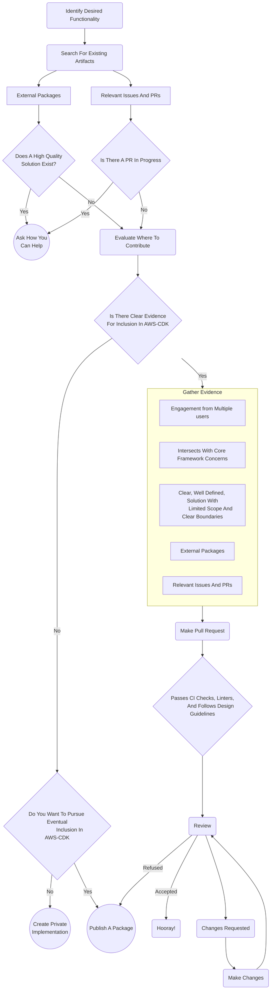
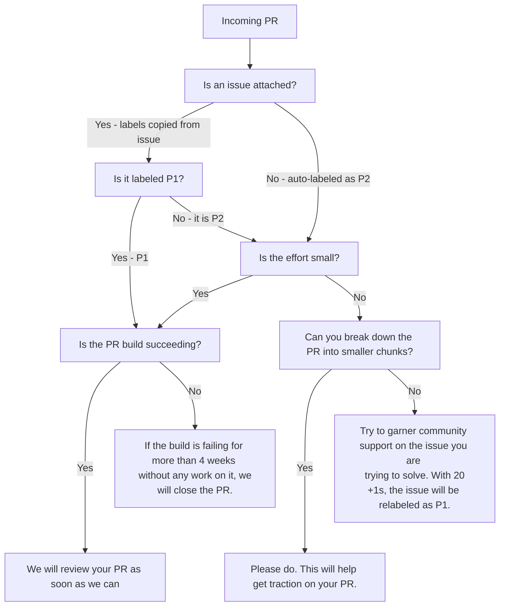

# Contributing to the AWS Cloud Development Kit

Thanks for your interest in contributing to the AWS CDK! ❤️

We highly value contributions, with roughly half of all commits to the CDK
coming from the community. We want to recognize all your hard work
by getting your code merged as quickly as we can, so please read the guidance
here carefully to make sure the review process goes smoothly.

The CDK is released under the [Apache license](http://aws.amazon.com/apache2.0/).
Any code you submit will be released under that license.

This document describes how to set up a development environment and submit your changes. Please
let us know if it's not up-to-date (even better, submit a PR with your  corrections ;-)).

- [Where To Contribute](#where-to-contribute)
  - [Demonstrating Value](#demonstrating-value)
  - [Publishing Your Own Package](#publishing-your-own-package)
    - [Trust and Third Party Packages](#trust-and-third-party-packages)
    - [Third Party Package Administration](#third-party-package-administration)
- [Getting Started](#getting-started)
  - [Local setup](#setup)
  - [Dev Container](#dev-container)
- [Pull Requests](#pull-requests)
  - [Step 1: Find something to work on](#step-1-find-something-to-work-on)
  - [Step 2: Design (optional)](#step-2-design)
  - [Step 3: Work your Magic](#step-3-work-your-magic)
  - [Step 4: Pull Request](#step-4-pull-request)
  - [Step 5: Merge](#step-5-merge)
- [Breaking Changes](#breaking-changes)
- [Documentation](#documentation)
  - [Rosetta](#rosetta)
- [Tools](#tools-advanced)
  - [Linters](#linters)
  - [scripts/foreach.sh](#scriptsforeachsh)
  - [Jetbrains support (WebStorm/IntelliJ)](#jetbrains-support-webstormintellij)
  - [Linking against this repository](#linking-against-this-repository)
  - [Running integration tests in parallel](#running-integration-tests-in-parallel)
  - [Visualizing dependencies in a CloudFormation Template](#visualizing-dependencies-in-a-cloudformation-template)
  - [Find dependency cycles between packages](#find-dependency-cycles-between-packages)
- [Running CLI integration tests](#running-cli-integration-tests)
- [Building aws-cdk-lib](#building-aws-cdk-lib)
- [Building and testing v2 -alpha packages](#building-and-testing-v2--alpha-packages)
- [Changing the Cloud Assembly Schema](#changing-cloud-assembly-schema)
- [Feature Flags](#feature-flags)
- [Versioning and Release](#versioning-and-release)
- [Troubleshooting](#troubleshooting)
- [Debugging](#debugging)
  - [Connecting the VS Code Debugger](#connecting-the-vs-code-debugger)
  - [Run a CDK unit test in the debugger](#run-a-cdk-unit-test-in-the-debugger)
- [Badges (Pilot Program)](#badges-pilot-program)
- [Related Repositories](#related-repositories)

## Contribution Workflow Diagram


## Where to Contribute

Contributions are accepted through a number of channels, including direct pull requests to the aws/aws-cdk repository. However, this may not be the ideal method depending on the circumstances of your proposed additions or changes. The aws-cdk team has limited availability for reviews, which means that sometimes, if making your change available for immediate use by yourself is your goal, it may be better to publish it in your own package or otherwise bypass the CDK team's review and feedback cycle. That being said, if your contribution contains changes that are desired by a large number of cdk users, we absolutely want to make sure those changes are included in the aws-cdk core packages.

Here are some things we look at when evaluating a contribution:

1. Signal - Is there a github issue, or possibly multiple related ones, that the contribution addresses. Do the issues have a lot of engagement, such as comments, +1 reactions, etc that indicate that many users are affected by it?
1. Size - Is the contribution limited to a relatively self-contained surface area? Is it broken up into the smallest possible unit of functionality that makes sense?
1. Priority - Does the contribution address an issue in, or add a new feature of, a service that has a high priority for coverage? These are generally core services most commonly used on AWS such as IAM, EC2, Lambda, and ECS.
1. Quality - Does the contribution take into account all of the guidance provided in our documentation regarding [design patterns](./docs/DESIGN_GUIDELINES.md), test coverage, and best practices as it relates to code within the aws-cdk repository? Does it also make an effort to follow patterns commonly used within the aws-cdk repository and not deviate unecessarily from these conventions?
1. Breaking Changes - Does the contribution introduce any risk for breaking existing users applications? Specifically, does it require any code changes or can it trigger any resource replacement in cloudformation that would result in downtime?

### Demonstrating Value

When you create a pull-request, make sure to include justification related to all of the relevant criteria within the PR description in order to make it clear to reviewers why your contribution should be accepted. Specifically, provide justification for why this is functionality that should live within the core aws-cdk packages and be maintained by the cdk team. Are there technical reasons why this functionality could not be vended separately etc? If we are not convinced that the functionality should be part of the core framework, and therefore close your pull request, here are some ways you can go about gathering evidence to convince us otherwise.

1. Link any relevant issues that you find and note their engagement by other users.
1. Describe common use cases that are not currently well served that your contribution addresses.
1. Link to any third party packages, including any published by you, and other prior art providing the same functionality.
1. Iterate the steps you have taken to ensure that the contribution is well thought out and stable.
1. Include any alternative solutions you explored and your reasoning as to why they weren't chosen.

All of this information will help make it clear to reviewers why your contribution should be accepted. If a reviewer is still not convinced that the contribution is necessary or effective, an alternative route should be pursued.

### Publishing Your Own Package

This is by far the strongest signal you can give to the CDK team that a feature should be included within the core aws-cdk packages. A package published on npm, pypi, maven central, nuget, and github (for go) that has good documentation, a clear purpose, and an active group of users is a good indication that the functionality it provides is useful and should be examined for inclusion in the core aws-cdk packages. This may not be the goal of any given package, and some constructs and features do not provide functionality that should ever be vended as part of the core framework. However, if a package you own does include functionality that you and other users believe should be vended as part of the core CDK, we encourage making a pull request, or RFC if appropriate, proposing it's inclusion.

#### Trust and Third Party Packages 

An argument we commonly hear why contributors don't want to publish their contributions in their own packages, is that organizations have restrictions on what packages they allow to be used and these restrictions commonly include limiting usage of packages to those owned and distributed only from trusted sources. We recognize trust is an important part of the software dependency chain, and we take that into consideration when evaluating contributions in aws-cdk. However, not everything can be owned by the aws-cdk team. Strictly from a technical limitation perspective, `aws-cdk-lib` is big. Continuing a system that makes it, potentially, many multiple times bigger, has a cost on usability. Additionally, as the surface area widens, the aws-cdk team becomes stretched ever thinner and isn't able to property maintain what we own.

That being said, "trust", isn't as black and white as "it's owned by aws, so it's okay". The best way to trust that the packages you depend on to help generate your aws resources is to use [policy validation](https://docs.aws.amazon.com/cdk/v2/guide/policy-validation-synthesis.html) on the output of your application in order to ensure it is following the rules that are important to you or your organization.

#### Third Party Package Administration

Another reason we hear from authors that they don't want to publish their own packages, is they don't want to go through the trouble of setting up their own repository and publishing toolchain. This is something we are continuously working on making easier and we encourage you to check out some of the tools that we have available to aid in this.

1. [Projen](https://github.com/projen/projen) - A tool with common repository and publishing setup abstracted, has a construct specifically for CDK construct libraries.
1. [Publib](https://github.com/cdklabs/publib) - A toolchain for publishing packages to multiple repositories. A lot of this is included in projen and we recommend using that instead of publib directly, but it may be useful for specific cases.
1. [Construct Hub](https://constructs.dev) - An index of all construct libraries published to NPM. When you publish a construct library, it will automatically have documentation generated and published to Construct Hub.

## Getting Started

The following steps describe how to set up the AWS CDK repository on your local machine.
The alternative is to use [Gitpod](https://www.gitpod.io/), a Cloud IDE for your development.
See [Gitpod section](#gitpod) on how to set up the CDK repo on Gitpod.

### Setup

The following tools need to be installed on your system prior to installing the CDK:

- [Node.js >= 14.15.0](https://nodejs.org/download/release/latest-v14.x/)
  - We recommend using a version in [Active LTS](https://nodejs.org/en/about/releases/)
- [Yarn >= 1.19.1, < 2](https://yarnpkg.com/lang/en/docs/install)
- [.NET SDK >= 6.0.x](https://www.microsoft.com/net/download)
- [Python >= 3.8.0, < 4.0](https://www.python.org/downloads/release/python-380/)
- [Docker >= 19.03](https://docs.docker.com/get-docker/)
  - the Docker daemon must also be running

First fork the repository, and then run the following commands to clone the repository locally.

```console
$ git clone https://github.com/{your-account}/aws-cdk.git
$ cd aws-cdk
$ yarn install
```

We recommend that you use [Visual Studio Code](https://code.visualstudio.com/) to work on the CDK.
We use `eslint` to keep our code consistent in terms of style and reducing defects. We recommend installing
the [eslint extension](https://marketplace.visualstudio.com/items?itemName=dbaeumer.vscode-eslint) as well.

Windows, as a development environment, has known performance and compatibility issues. To help in this case, consider using [Gitpod](#gitpod) or [Amazon CodeCatalyst DevEnv](https://docs.aws.amazon.com/toolkit-for-vscode/latest/userguide/codecatalyst-service.html) instead.

### Repo Layout

The AWS CDK is a [NPM](https://www.npmjs.com/about) project written in [typescript](https://www.typescriptlang.org/).
More specifically, it is a [monorepo managed using lerna](https://github.com/lerna/lerna#about).
If you're unfamiliar with any of these technologies, it is useful to learn about them and will make understanding the
AWS CDK codebase easier but strictly not necessary for simple contributions.

The CDK uses [jsii](https://github.com/aws/jsii/) as its primary build system. jsii enables us to write
typescript-compliant source code and produce polyglot libraries, such as, in Java, .NET, Python and Go.

The repo contains `packages/` directory that contains the CDK public modules. The source code for the IAM module in the
CDK can be found at the location `packages/aws-cdk-lib/aws-iam`.
The repo also contains the `tools/` directory that holds custom build tooling (modeled as private npm packages)
specific to the CDK.

### Building aws-cdk-lib

The full build of all of the packages within the repository can take a few minutes, about 20  when all tests are run.
Most contributions only require working on a single package, usually `aws-cdk-lib`. To build this package for the first
time, you can execute the following to build it and it's dependencies.

```console
$ npx lerna run build --scope=aws-cdk-lib
```

Note: `lerna` uses a local cache by default. If your build fails, you can fix
the issue and run the command again and it will not rerun any previously
successful steps.

Note: If you encounter `ERROR: Reached heap limit Allocation failed - JavaScript heap out of memory`, please try running the command with increased memory by using `export NODE_OPTIONS="--max-old-space-size=8192"`.

At this point, you can run build and test the `aws-cdk-lib` module by running

```console
$ cd packages/aws-cdk-lib
$ yarn build
$ yarn test
```

To cut down on iteration time as you develop, you can run `yarn watch` within the `aws-cdk-lib` directory to keep
some of the build state in memory and incrementally rebuild as you make changes.

However, if you wish to build the entire repository, the following command will achieve this.

```console
cd <root of the CDK repo>
npx lerna run build
```

You are now ready to start contributing to the CDK. See the [Pull Requests](#pull-requests) section on how to make your
changes and submit it as a pull request.

If you want to run a build without using the local cache, provide the
`--skip-nx-cache` flag.

```console
$ npx lerna run build --skip-nx-cache
```

### Pack

As called out in the above sections, the AWS CDK uses jsii to produce polyglot targets. This means that each CDK module
produces artifact in all of its target languages.

Packing involves generating CDK code in the various target languages and packaging them up to be published to their
respective package managers. Once in a while, these will need to be generated either to test the experience of a new
feature, or reproduce a packaging failure.

To package a specific module, say the `aws-cdk-lib` module:

```console
$ cd <root-of-cdk-repo>
$ docker run --rm --net=host -it -v $PWD:$PWD -w $PWD jsii/superchain:1-buster-slim
docker$ cd packages/aws-cdk-lib
docker$ ../../scripts/foreach.sh --up yarn run package
docker$ exit
```

The `dist/` folder within each module contains the packaged up language artifacts.

### Dev Container

The AWS CDK provides a VS Code Dev Container with all dependencies pre-installed.
Please follow the [setup instructions](https://code.visualstudio.com/docs/remote/containers-tutorial) to configure VS Code.

With VS Code setup, you will be prompted to open the `aws-cdk` repo in a Dev Container, or you can choose "Dev Containers: Reopen in Container" from the VS Code command palette.

### Gitpod

You may also set up your local development environment using [Gitpod](http://gitpod.io) -
a service that allows you to spin up an in-browser Visual Studio Code-compatible editor,
with everything set up and ready to go for CDK development.
Just click the button below to create your private workspace:

[](https://gitpod.io/#https://github.com/aws/aws-cdk)

This will start a new Gitpod workspace, with the CDK repository [pre-built](https://www.gitpod.io/docs/prebuilds/).
You can now work on your CDK repository, as described in the [Getting Started](#getting-started) section.

Gitpod is free for 50 hours per month - make sure to stop your workspace when you're done
(you can always resume it later, and it won't need to run the build again).

For Gitpod users only! The best way to authenticate AWS in Gitpod is to use AWS IAM Identity Center(successor to AWS Single Sign-On). [Install AWS CLI v2](https://docs.aws.amazon.com/cli/latest/userguide/getting-started-install.html#getting-started-install-instructions) and configure it as follows:

```shell
# make sure AWS CLI v2 is in your $PATH
$ aws --version
# configure the AWS profile with SSO
$ aws configure sso
# login and authenticate
$ aws sso login
# verify your current identity
$ aws sts get-caller-identity
```

Check out [this document](https://docs.aws.amazon.com/cli/latest/userguide/sso-configure-profile-token.html) for the details.

Alternatively, supply CDK with your AWS credentials as
[persisting environment variables](https://www.gitpod.io/docs/environment-variables).
Adding them works as follows via terminal:

```shell
eval $(gp env -e AWS_ACCESS_KEY_ID=XXXXXXXXX)
eval $(gp env -e AWS_SECRET_ACCESS_KEY=YYYYYYY)
eval $(gp env -e AWS_DEFAULT_REGION=ZZZZZZZZ)
eval $(gp env -e)
```

### Amazon CodeCatalyst Dev Environments

Dev Environments are cloud-based development environments.
[Amazon CodeCatalyst](https://aws.amazon.com/codecatalyst/) allows you to checkout your linked Github
repositories in your Dev Environments with your favorite local IDEs such as VSCode or JetBrains.

Build up `aws-cdk-lib` as well as `framework-integ` when you enter your Dev Env:

```shell
$ yarn install
$ NODE_OPTIONS=--max-old-space-size=8192 npx lerna run build --scope=aws-cdk-lib --scope=@aws-cdk-testing/framework-integ
```

You may [configure your Dev Env](https://docs.aws.amazon.com/codecatalyst/latest/userguide/devenvironment-devfile.html) with the `devfile.yaml` to further customize your Dev Env for CDK development.

Read the links below for more details:
- [Dev Environments in CodeCatalyst](https://docs.aws.amazon.com/codecatalyst/latest/userguide/devenvironment.html)
- [Using GitHub repositories in CodeCatalyst](https://docs.aws.amazon.com/codecatalyst/latest/userguide/extensions-github.html)
- [Setting up to use the AWS CLI with CodeCatalyst](https://docs.aws.amazon.com/codecatalyst/latest/userguide/set-up-cli.html)

## Pull Requests

Below is a flow chart that describes how your PR may be treated by repository maintainers:



Note that, if we do not have time to review your PR, it is not the end of the road. We are asking
for more community support on the attached issue before we focus our attention there. Any `P2` issue
with 20 or more +1s will be automatically upgraded from `P2`to `P1`.

### Step 1: Find something to work on

If you want to contribute a specific feature or fix you have in mind, look to see if an issue
already exists in our [backlog](https://github.com/aws/aws-cdk/issues). If not, please contribute
a feature request or bug report prior to contributing the PR. We will triage this issue promptly,
and the priority of the issue (`P1` or `P2`) will give indication of how much attention your PR
may get.

It's not required to submit an issue first, but PRs that come in without attached issues will be
automatically labeled as `P2`.

On the other hand, if you are here looking for an issue to work on, explore our [backlog of
issues](https://github.com/aws/aws-cdk/issues) and find something that piques your interest.
We have labeled all of our issues for easy searching. If you are looking for your first contribution,
the ['good first issue' label](https://github.com/aws/aws-cdk/issues?q=is%3Aissue+is%3Aopen+label%3A%22good+first+issue%22)
will be of help.

It's a good idea to keep the priority of issues in mind when deciding what to
work on. If we have labelled an issue as `P2`, it means it's something we won't
get to soon, and we're waiting on more feedback from the community (in the form
of +1s and comments) to give it a higher priority. A PR for a `P2` issue may
be closed by a maintainer, especially if it involves a complex
implementation. `P1` issues impact a significant number of customers, so we are
much more likely to give a PR for those issues prompt attention.

### Step 2: Design

In some cases, it is useful to seek feedback by iterating on a design document. This is useful when you plan a big change or feature, or you want advice on what would be the best path forward.

In many cases, the comments section of the relevant Github issue is sufficent for such discussion, and can be a good place to socialize and get feedback on what you plan to do. If the changes are significant in scope, require a longer form medium to communicate, or you just want to ensure that the core team agrees with your planned implementation before you submit it for review to avoid wasted work, there are a few different strategies you can pursue.

1. README driven development - This is the core team's preferred method for reviewing new APIs. Submit a draft PR with updates to the README for the package that you intend to change that clearly describes how the functionality will be used. For new L2s, include usage examples that cover common use cases and showcase the features of the API you're designing. The most important thing to consider for any feature is the public API and this will help to give a clear picture of what changes users can expect.
1. Write an [RFC](aws/aws-cdk-rfcs) - This is a process for discussing new functionality that is large in scope, may incur breaking changes, or may otherwise warrant discussion from multiple stakeholders on the core team or within the community. Spefically, it is a good place to discuss new features in the core CDK framework or the CLI that are unable to be decoupled from the core cdk codebase.
1. Publish a package - A separate package is the best place to demonstrate the value of new functionality that you believe should be included within the CDK core libraries. It not only illustrates a complete solution with it's entire API surface area available to review, it also proves that your design works! When publishing a package with the goal for eventual inclusion within aws-cdk-lib, make sure to follow our [design guidelines](./docs/DESIGN_GUIDELINES.md) wherever relevant.

Performing any of the above processes helps us to ensure that expectations are clearly set before a contribution is made. We want to ensure that everyone is able to contribute to the CDK ecosystem effectively. If you make a contribution that is ultimately not merged by into aws-cdk-lib, but you believe it should be, we encourage you to keep pursuing it. The scope of the core framework is intentionally limited to ensure that we can effectively maintain it's surface area and ensure code quality and reliablity over the long term. However, new patterns may emerge in the ecosystem that clearly provide better solutions than those currently in aws-cdk-lib. If your solutions gains popularity within the community, and you want us to re-evaluate it's inclusion, reach out to us on cdk.dev or create a github issue with a feature request and references to your package. See [demonstrating value](#demonstrating-value) for more information. 

### Step 3: Work your Magic

Work your magic. Here are some guidelines:

* Coding style.
  * If your change introduces a new construct, take a look at our [design guidelines](./docs/DESIGN_GUIDELINES.md) for
    construct libraries.
    We also have an [example construct library](packages/@aws-cdk/example-construct-library) that showcases a simple
    construct library with a single construct.
  * We have a number of linters that run during standard build that will enforce coding consistency and correctness.
    Watch out for their error messages and adjust your code accordingly.
* Every change requires a unit test
* If you change APIs, make sure to update the module's README file
  * When you add new examples to the module's README file, you must also ensure they compile - the PR build will fail
    if they do not. To learn more about how to ensure that they compile, see [Documentation](#documentation).
* Try to maintain a single feature/bugfix per pull request. It's okay to introduce a little bit of housekeeping
  changes along the way, but try to avoid conflating multiple features. Eventually, all these are going to go into a
  single commit, so you can use that to frame your scope.

#### Integration Tests

Integration tests perform a few functions in the CDK code base -
1. Acts as a regression detector. It does this by running `cdk synth` on the integration test and comparing it against
   the `*.snapshot` directory. This highlights how a change affects the synthesized stacks.
2. Allows for a way to verify if the stacks are still valid CloudFormation templates, as part of an intrusive change.
   This is done by running `yarn integ` which will run `cdk deploy` across all of the integration tests in that package. If you are developing a new integration test or for some other reason want to work on a single integration test over and over again without running through all the integration tests you can do so using `yarn integ integ.test-name.js`
   Remember to set up AWS credentials before doing this.
3. (Optionally) Acts as a way to validate that constructs set up the CloudFormation resources as expected. A successful
   CloudFormation deployment does not mean that the resources are set up correctly.

**Build framework-integ**

You need to build the `framework-integ` before running the `yarn integ`

```console
$ npx lerna run build --scope=@aws-cdk-testing/framework-integ
```

**When are integration tests required?**

The following list contains common scenarios where we _know_ that integration tests are required.
This is not an exhaustive list and we will, by default, require integration tests for all
new features and all fixes unless there is a good reason why one is not needed.

1. Adding a new feature
2. Adding a fix to an existing feature
3. Involves configuring resource types across services (i.e. integrations)
4. Adding a new supported version (e.g. a new [AuroraMysqlEngineVersion](https://docs.aws.amazon.com/cdk/api/v2/docs/aws-cdk-lib.aws_rds.AuroraMysqlEngineVersion.html))
5. Adding any functionality via a [Custom Resource](https://docs.aws.amazon.com/cdk/api/v2/docs/aws-cdk-lib.custom_resources-readme.html)

All integration tests going forward should use the [IntegTest](https://github.com/aws/aws-cdk/blob/main/packages/%40aws-cdk/integ-tests-alpha/lib/test-case.ts#L148)
construct. Over time we will be updating all of our existing tests to use this construct. It
allows for more control over configuring each tests as well as the ability to perform
assertions against the deployed infrastructure.

```ts
/*
 * Stack verification steps:
 * * <step-1>
 * * <step-2>
 */
```

Examples:
* [integ.destinations.ts](https://github.com/aws/aws-cdk/blob/main/packages/%40aws-cdk-testing/framework-integ/test/aws-lambda-destinations/test/integ.destinations.ts#L7)
* [integ.put-events.ts](https://github.com/aws/aws-cdk/blob/main/packages/%40aws-cdk-testing/framework-integ/test/aws-stepfunctions-tasks/test/eventbridge/integ.put-events.ts)

**What if you cannot run integration tests**

If you are working on a PR that requires an update to an integration test and you are unable
to run the `cdk-integ` tool to perform a real deployment, please call this out on the pull request
so a maintainer can run the tests for you. Please **do not** run the `cdk-integ` tool with `--dry-run`
or manually update the snapshot.

See the [integration test guide](./INTEGRATION_TESTS.md) for a more complete guide on running
CDK integration tests.

#### yarn watch (Optional)

We've added a watch feature to the CDK that builds your code as you type it. Start this by running `yarn watch` for
each module that you are modifying.

For example, watch the aws-cdk-lib and aws-cdk modules in a second terminal session:

```console
$ cd packages/aws-cdk-lib
$ yarn watch & # runs in the background
$ cd packages/aws-cdk
$ yarn watch & # runs in the background
```

#### Verify your fix by deployment

If your PR updates a specific library, you might want to write a simple CDK application and make sure it synthesizes and
deploys correctly. For example, if you modify files under `packages/aws-cdk-lib/aws-eks`, you can write a simple CDK app in typescript to verify its behavior:


```console
$ cd packages/@aws-cdk-testing/framework-integ/test/aws-eks/test
```

Create a `sample.ts` like this:

```ts
import {
  App, Stack,
  aws_eks as eks,
  aws_ec2 as ec2,
} from 'aws-cdk-lib';
import { getClusterVersionConfig } from './integ-tests-kubernetes-version';

const app = new App();
const env = { region: process.env.CDK_DEFAULT_REGION, account: process.env.CDK_DEFAULT_ACCOUNT };
const stack = new Stack(app, 'my-test-stack', { env });

const cluster = new eks.Cluster(stack, 'Cluster', {
  vpc,
  ...getClusterVersionConfig(stack),
  defaultCapacity: 0,
});
```

Run `yarn watch` or `npx tsc --watch` in a separate terminal to compile `sample.ts` to `sample.js`:

```console
$ cd packages/@aws-cdk-testing/framework-integ
$ yarn watch
or
$ npx tsc --watch
```

Make sure you have configured [AWS CLI with AWS Authentication](https://docs.aws.amazon.com/cdk/v2/guide/getting_started.html#getting_started_auth) as we will deploy it in our AWS account.

Deploy the sample app:

```console
$ cd packages/@aws-cdk-testing/framework-integ
$ npx cdk -a test/aws-eks/test/sample.js diff
$ npx cdk -a test/aws-eks/test/sample.js deploy
```

This allows you to iterate your development and ensure a minimal sample app would successfully deploy as you expect.
You have the freedom to interact with it just as a common CDK app such as viewing differences with `npx cdk diff`
or pass context variables with `npx cdk deploy -c`. You can rapidly iterate your testing with repeated deployments
by importing existing resource such as existing VPC. This can save a lot of time and help you focus on the core changes.

```ts
const vpc = ec2.Vpc.fromLookup(stack, 'Vpc', { isDefault: true });
```

As this is for testing only, do not commit `sample.ts` and `sample.js` to your PR branch.

Alternatively, you can write this test as a new integration test like `integ.my-test.ts` and deploy it
using `yarn integ --no-clean`. This may be useful when you need to publish a new
integration test:

```console
$ cd packages/@aws-cdk-testing/framework-integ
$ yarn integ test/aws-eks/test/integ.my-test.js --no-clean --update-on-failed
```

After verifying your work with a simple deployment as above, you need to ensure your change can pass all existing
unit tests and integ tests and fix them if necessary.

Run all the unit tests for a specific module(e.g. aws-eks):

```console
$ cd packages/aws-cdk-lib
$ yarn test aws-eks
```

Or run a specific unit test

```console
$ cd packages/aws-cdk-lib
$ npx jest aws-eks/test/name.test.js
```

Run all integ tests for a specific module(e.g. aws-eks):

```console
$ cd packages/@aws-cdk-testing/framework-integ
$ yarn integ --directory test/aws-eks/test
```

Or run a specific integ test:

```console
$ yarn integ test/aws-eks/test/integ.name.js
```

See the [integration test guide](./INTEGRATION_TESTS.md) for a more complete guide on running
CDK integration tests.


### Step 4: Pull Request

* Create a [fork](https://docs.github.com/en/get-started/quickstart/fork-a-repo) of the CDK repository.
* Create a new branch for your change, and push the change commits on it.
  > [!IMPORTANT]
  > Your pull request must be based off of a branch in a personal account (not an organization owned account, and not the `main` branch).
  > You must also have the setting enabled that [allows the CDK team to push changes to your branch](https://docs.github.com/en/pull-requests/collaborating-with-pull-requests/working-with-forks/allowing-changes-to-a-pull-request-branch-created-from-a-fork) (this setting is enabled by default for personal accounts,
  > and cannot be enabled for organization owned accounts).
  > The reason for this is that our automation needs to synchronize your branch with our `main` after it has been approved, and
  > we cannot do that if we cannot push to your branch.
  
  > [!NOTE]
  > CDK core members can push to a branch on the AWS CDK repo (naming convention: `<user>/<feature-bug-name>`).

* Create a [pull request on
  Github](https://docs.github.com/en/github/collaborating-with-pull-requests/proposing-changes-to-your-work-with-pull-requests/creating-a-pull-request-from-a-fork).

* Pull request title and message (and PR title and description) must adhere to
  [conventionalcommits](https://www.conventionalcommits.org).
  * The title must begin with `feat(module): title`, `fix(module): title`, `refactor(module): title` or
    `chore(module): title`.
    * `feat`: indicates a feature added (requires tests and README updates in principle, but can be suppressed)
    * `fix`: indicates a bug fixes (requires tests in principle, but can be suppressed)
    * `docs`: indicates updated documentation (docstrings or Markdown files)
    * `refactor`: indicates a feature-preserving refactoring
    * `chore`: something without directly visible user benefit (does not end up in the CHANGELOG). Typically used for build scripts, config, or changes so minor they don't warrant showing up the CHANGELOG.
  * Titles for `feat` and `fix` PRs end up in the change log. Think about what makes most sense for users reading the changelog while writing them.
    * `feat`: describe the feature (not the action of creating the commit or PR, for example, avoid words like "added" or "changed")
    * `fix`: describe the bug (not the solution)
  * Title should be lowercase.
  * No period at the end of the title.

* Pull request body should describe _motivation_. Think about your code reviewers and what information they need in
  order to understand what you did. If it's a big commit (hopefully not), try to provide some good entry points so
  it will be easier to follow.
  * For bugs, describe bug, root cause, solution, potential alternatives considered but discarded.
  * For features, describe use case, most salient design aspects (especially if new), potential alternatives.

* Pull request message should indicate which issues are fixed: `fixes #<issue>` or `closes #<issue>`.

* Shout out to collaborators.

* Call out any new [runtime dependencies](#adding-construct-runtime-dependencies) that are created as part of your PR.

* If not obvious (i.e. from unit tests), describe how you verified that your change works.

* If this PR includes breaking changes, they must be listed at the end in the following format
  (notice how multiple breaking changes should be formatted):

  ```
  BREAKING CHANGE: Description of what broke and how to achieve this behavior now
  * **module-name:** Another breaking change
  * **module-name:** Yet another breaking change
  ```

  Breaking changes are only allowed in experimental libraries. Experimental
  libraries are published with an `-alpha` suffix, and have the `stability`
  property set to `experimental` in their `package.json`.

* Once the pull request is submitted, a reviewer will be assigned by the maintainers.

* If the PR build is failing, update the PR with fixes until the build succeeds. You may have trouble getting attention
  from maintainers if your build is failing, and after 4 weeks of staleness, your PR will be automatically closed.

* Discuss review comments and iterate until you get at least one "Approve". When iterating, push new commits to the
  same branch. Usually all these are going to be squashed when you merge to main. The commit messages should be hints
  for you when you finalize your merge commit message.

* Make sure to update the PR title/description if things change. The PR title/description are going to be used as the
  commit title/message and will appear in the CHANGELOG, so maintain them all the way throughout the process.

#### Getting a review from a maintainer

We get A LOT of pull requests, which is a great thing! To help us prioritize
which pull requests to review we first make sure that the pull request is in a
mergeable state. This means that the pull request:

1. Is ready for review (not a draft)
2. Does not have any merge conflicts
3. Has a passing build
4. Does not have any requested changes by a maintainer
5. Has a passing `PR Linter` workflow **OR** the contributor has requested
   an exemption/clarification.

To make this easier we have a `pr/needs-review` label that we can add to each
PR. If you do not see this label on your PR then it means that something needs
to be fixed before it can be reviewed.

#### Adding construct runtime dependencies

Any tool that is not part of the CDK, and needs to be used by a construct during
deployment or runtime, can be included in the CDK Framework Library in one of two
ways.

1. Add a direct dependency on an npm package containing the tool. For example,
   `@aws-cdk/asset-awscli-v1`.
2. Expose a property on the construct you are creating that allows users to
   supply their own version of the tool. For example, the `eks.Cluster`
   construct has a construct prop called `kubectlLayer` where you must provide a
   version of `kubectl` from one of the `@aws-cdk/asset-kubectl-vXY` packages.
   The version of `kubectl` must be compatible with the Kubernetes version of
   the cluster.

Both options involve creating separate repositories (like this
[one](https://github.com/cdklabs/awscdk-asset-kubectl) for kubectl). If you
would like to introduce additional runtime dependencies, it likely involves
discussing with a CDK maintainer and opening a new repository in cdklabs that
vends the dependency as a lambda layer. Generally, each branch on the repository
will focus on a specific version of the dependency. For example, in
`awscdk-asset-kubectl`, branch `kubectl-v20/main` vends kubectl v1.20, branch
`kubectl-v21/main` vends kubectl v1.21, and so on.

**If your PR introduces runtime dependencies in lambda layers, make sure to call
it out in the description so that we can discuss the best way to manage that
dependency.**

#### Adding new unconventional dependencies

> [!WARNING]
> Do not add these. If there is a tool that you want to use in your
> CDK constructs, see [Adding construct runtime
> dependencies](#Adding-construct-runtime-dependencies).

**For the aws-cdk an unconventional dependency is defined as any dependency that is not managed via the module's
`package.json` file.**

Sometimes, constructs introduce new unconventional dependencies. Any new unconventional dependency that is introduced needs to have
an auto upgrade process in place. The recommended way to update dependencies is through
[dependabot](https://docs.github.com/en/code-security/supply-chain-security/keeping-your-dependencies-updated-automatically/configuration-options-for-dependency-updates).
You can find the dependabot config file [here](./.github/dependabot.yml).

**If you think your PR introduces a new unconventional dependency, make sure to call it
out in the description so that we can discuss the best way to manage that dependency.**

### Step 5: Merge

* Make sure your PR builds successfully (we have CodeBuild setup to automatically build all PRs).
* Once approved and tested, one of our bots will squash-merge to main and will use your PR title/description as the
  commit message.

## Breaking Changes

**_NOTE_**: _Starting with version 2.0.0 of the AWS CDK, **all modules and members vended as part of the main CDK library**_
_**(`aws-cdk-lib`) will always be stable**; we are committing to never introduce breaking changes in a non-major bump._
_Breaking changes are only allowed on pre-released (experimental or dev preview) modules_
_(those with a `stability` of `experimental` in their respective `package.json` files)._
_For v1, each module is separately released. For v2, only `stable` modules are released as part of the_
_main `aws-cdk-lib` release, and all `experimental` modules are released independently as `-alpha` versions,_
_and not included in the main CDK library._

Whenever you are making changes, there is a chance for those changes to be
*breaking* existing users of the library. A change is breaking if there are
programs that customers could have been writing against the current version
of the CDK, that will no longer "work correctly" with the proposed new
version of the CDK.

Breaking changes are not allowed in *stable* libraries. They are permitted
in experimental libraries, unless the maintainer of the module decides that it should be avoided.
Breaking changes require explicit callouts in the bodies of Pull Requests that introduce them.

Breaking changes come in two flavors:

* API surface changes
* Behavior changes


### API surface changes

This encompasses any changes that affect the shape of the API. Changes that
will make existing programs fail to compile are not allowed. Typical examples
of that are:

* Renaming classes or methods
* Adding required properties to a struct that is used as an input to a constructor
  or method. This also includes changing a type from nullable to non-nullable.
* Removing properties from a struct that is returned from a method, or removing
  properties from a class. This also includes changing a type from non-nullable
  to nullable.

To see why the latter is a problem, consider the following class:

```ts
class SomeClass {
  public readonly count: number;
  //               ❓ let's say I want to change this to 'count?: number',
  //                  i.e. make it optional.
}

// Someone could have written the following code:
const obj = new SomeClass();
console.log(obj.count + 1);

// After the proposed change, this code that used to compile fine will now throw:
console.log(obj.count + 1);
//          ~~~~~~~~~ Error: Object is possibly 'undefined'.
```

CDK comes with build tooling to check whether changes you made introduce breaking
changes to the API surface. In a package directory, run:

```shell
$ yarn build
$ yarn compat
```

The only case where it is legitimate to break a public API is if the existing
API is a bug that blocked the usage of a feature. This means that by breaking
this API we will not break anyone, because they weren't able to use it. The file
`allowed-breaking-changes.txt` in the root of the repo is an exclusion file that
can be used in these cases.

#### Dealing with breaking API surface changes

If you need to change the type of some API element, introduce a new API
element and mark the old API element as `@deprecated`.

If you need to pretend to have a value for the purposes of implementing an API
and you don't actually have a useful value to return, it is acceptable to make
the property a `getter` and throw an exception (keeping in mind to write error
messages that will be useful to a user of your construct):

```ts
class SomeClass implements ICountable {
  constructor(private readonly _count?: number) {
  }

  public get count(): number {
    if (this._count === undefined) {
      // ✅ DO: throw a descriptive error that tells the user what to do
      throw new Error('This operation requires that a \'count\' is specified when SomeClass is created.');
      // ❌ DO NOT: just throw an error like 'count is missing'
    }
    return this._count;
  }
}
```

### Behavior changes

These are changes that do not directly affect the compilation of programs
written against the previous API, but may change their meaning. In practice,
even though the user didn't change their code, the CloudFormation template
that gets synthesized is now different.

**Not all template changes are breaking changes!** Consider a user that has
created a Stack using the previous version of the library, has updated their
version of the CDK library and is now deploying an update. A behavior change
is breaking if:

* The update cannot be applied at all
* The update can be applied but causes service interruption or data loss.

Data loss happens when the [Logical
ID](https://docs.aws.amazon.com/cdk/latest/guide/identifiers.html#identifiers_logical_ids)
of a stateful resource changes, or one of the [resource properties that requires
replacement](https://docs.aws.amazon.com/AWSCloudFormation/latest/UserGuide/using-cfn-updating-stacks-update-behaviors.html)
is modified. In both of these cases, CloudFormation will delete the
resource, and if it was a stateful resource like a database the data in it is now gone.

If a change applies cleanly and does not cause any service interruption, it
is not breaking. Nevertheless, it might still be wise to avoid those kinds of
changes as users are understandably wary of unexpected template changes, will
scrutinize them heavily, and we don't want to cause unnecessary panic and churn
in our use base.

Determining whether or not behavioral changes are breaking requires expertise
and judgement on the part of the library owner, and testing.

#### Dealing with breaking behavior changes

Most of the time, behavioral changes will arise because we want to change the
default value or default behavior of some property (i.e., we want to change the
interpretation of what it means if the value is missing).

If the new behavior is going to be breaking, the user must opt in to it, either by:

* Adding a new API element (class, property, method, ...) to have users
  explicitly opt in to the new behavior at the source code level (potentially
  `@deprecate`ing the old API element); or
* Use the [feature flag](#feature-flags) mechanism to have the user opt in to the new
  behavior without changing the source code.

Of these two, the first one is preferred if possible (as feature flags have
non-local effects which can cause unintended effects).

### Adding new experimental ("preview") APIs

To make sure we can keep adding features fast, while keeping our commitment to
not release breaking changes, we are introducing a new model - API Previews.
APIs that we want to get in front of developers early, and are not yet
finalized, will be added to the AWS CDK with a specific suffix: `BetaX`. APIs
with the preview suffix will never be removed, instead they will be deprecated
and replaced by either the stable version (without the suffix), or by a newer
preview version. For example, assume we add the method
`grantAwesomePowerBeta1`:

```ts
/**
 * This methods grants awesome powers
 */
grantAwesomePowerBeta1();
```

Times goes by, we get feedback that this method will actually be much better
if it accepts a `Principal`. Since adding a required property is a breaking
change, we will add `grantAwesomePowerBeta2()` and deprecate
`grantAwesomePowerBeta1`:

```ts
/**
* This methods grants awesome powers to the given principal
*
* @param grantee The principal to grant powers to
*/
grantAwesomePowerBeta2(grantee: iam.IGrantable)

/**
* This methods grants awesome powers
* @deprecated use grantAwesomePowerBeta2
*/
grantAwesomePowerBeta1()
```

When we decide its time to graduate the API, the latest preview version will
be deprecated and the final version - `grantAwesomePower` will be added.

## Documentation

Every module's README is rendered as the landing page of the official documentation. For example, this is
the README for the `aws-ec2` module - https://docs.aws.amazon.com/cdk/api/latest/docs/aws-ec2-readme.html.

### Rosetta

The README file contains code snippets written as typescript code. Code snippets typed in fenced code blocks
(such as `` ```ts ``) will be automatically extracted, compiled and translated to other languages when the
during the [pack](#pack) step. We call this feature 'rosetta'.

You can run rosetta on the aws-cdk-lib module (or any other module) by running:

```console
$ cd packages/aws-cdk-lib
$ yarn rosetta:extract --strict
```

To successfully do that, they must be compilable. The easiest way to do that is using
a *fixture*, which looks like this:

````
```ts fixture=with-bucket
bucket.addLifecycleTransition({ ...props });
```
````

While processing the examples, the tool will look for a file called
`rosetta/with-bucket.ts-fixture` in the package directory. This file will be
treated as a regular TypeScript source file, but it must also contain the text
`/// here`, at which point the example will be inserted. The complete file must
compile properly.

Before the `/// here` marker, the fixture should import the necessary packages
and initialize the required variables.

When no fixture is specified, the fixture with the name
`rosetta/default.ts-fixture` will be used if present. `nofixture` can be used to
opt out of that behavior.

In an `@example` block, which is unfenced, additional information pertaining to
the example can be provided via the `@exampleMetadata` tag:

```
/**
 * @exampleMetadata fixture=with-bucket
 * @example
 *   /// fixture=with-bucket
 *   bucket.addLifecycleTransition({ ...props });
 */
```

For a practical example of how making sample code compilable works, see the
`aws-ec2` package.

> ⚠️ NOTE: README files often contain code snippets that refer to modules that are consumers
> of the current module, and hence not present in the current module's dependency closure.
> Compilation of these snippets will fail if the module referenced has not been built.
> For the best experience when working on snippets, a full build of the CDK repo is required.
> However, it may be prudent to "build up" these modules as required.

#### Recommendations

In order to offer a consistent documentation style throughout the AWS CDK
codebase, example code should follow the following recommendations (there may be
cases where some of those do not apply - good judgement is to be applied):

- Types from the documented module should be **un-qualified**:

  ```ts
  // An example in the aws-cdk-lib library, which defines Duration
  Duration.minutes(15);
  ```

- Types from other modules should be **qualified**:

  ```ts
  // An example in the aws-cdk-lib library, using something from aws-cdk-lib/aws-s3
  const bucket = new s3.Bucket(this, 'Bucket');
  // ...rest of the example...
  ```

- Make use of `declare` statements directly in examples for values that are
  necessary for compilation but unimportant to the example:

  ```ts
  // An example about adding a stage to a pipeline in the aws-cdk-lib/pipelines library
  declare const pipeline: pipelines.CodePipeline;
  declare const myStage: Stage;
  pipeline.addStage(myStage);
  ```

- Utilize the `default.ts-fixture` that already exists rather than writing new
  `.ts-fixture` files. This is because values stored in `.ts-fixture` files do
  not surface to the examples visible in the docs, so while they help successful
  compilation, they do not help users understand the example.

## Tools (Advanced)

### scripts/foreach.sh

This wonderful tool allows you to execute a command for all modules in this repo
in topological order, but has the incredible property of being stateful. This
means that if a command fails, you can fix the issue and resume from where you
left off.

To start a session, run:

```console
$ scripts/foreach.sh COMMAND
```

This will execute "COMMAND" for each module in the repo (cwd will be the directory of the module).
If a task fails, it will stop. To resume, simply run `foreach.sh` again (with or without the same command).

To reset the session (either when all tasks finished or if you wish to run a different session), run:

```console
$ scripts/foreach.sh --reset
```

If you wish to run a command only against a module's dependency closure, use:

```console
$ cd packages/my-module
$ ../scripts/foreach.sh --up COMMAND
```

This will execute `COMMAND` against `my-module` and all its deps (in a topological order, of course).

Consequently, there are two useful scripts that are built on top of `foreach.sh`, and lets you build modules.

- __`scripts/buildup`__: builds the current module and all of its dependencies (in topological order).
- __`scripts/builddown`__: builds the current module and all of its consumers (in topological order).

### Linters

All linters are executed automatically as part of the build script, `yarn build`.

They can also be executed independently of the build script. From the root of a specific package (e.g.
`packages/aws-cdk-lib`), run the following command to execute all the linters on that package -

```bash
yarn lint
```

The following linters are used:

- [eslint](#eslint)
- [pkglint](#pkglint)
- [awslint](#awslint)

#### eslint

All packages in the repo use a standard base configuration found at [eslintrc.js](tools/@aws-cdk/cdk-build-tools/config/eslintrc.js).
This can be customized for any package by modifying the `.eslintrc` file found at its root.

If you're using the VS Code and would like to see eslint violations on it, install the [eslint
extension](https://marketplace.visualstudio.com/items?itemName=dbaeumer.vscode-eslint).

#### pkglint

The `pkglint` tool "lints" package.json files across the repo according to [rules.ts](tools/@aws-cdk/pkglint/lib/rules.ts).

To evaluate (and attempt to fix) all package linting issues in the repo, run the following command from the root of the
repository (after bootstrapping):

```console
$ lerna run pkglint
```

You can also do that per package:

```console
$ lr pkglint
```

#### awslint

**awslint** is a linter for the AWS Construct Library APIs. It is executed as a
part of the build of all AWS modules in the project and enforces the [AWS
Construct Library Design Guidelines](./docs/DESIGN_GUIDELINES.md).

For more information about this tool, see the [awslint
README](./packages/awslint/README.md).

Generally speaking, if you make any changes which violate an awslint rule, build
will fail with appropriate messages. All rules are documented and explained in
the [guidelines](./docs/DESIGN_GUIDELINES.md).

Here are a few useful commands:

 * `yarn awslint` in every module will run __awslint__ for that module.
 * `yarn awslint list` prints all rules (details and rationale in the guidelines doc).
 * `scripts/foreach.sh yarn awslint` will start linting the entire repo, progressively. Rerun `scripts/foreach.sh` after fixing to continue.
 * `lerna run awslint --no-bail --stream 2> awslint.txt` will run __awslint__ in all modules and collect all results into awslint.txt
 * `lerna run awslint -- -i <RULE>` will run awslint throughout the repo and
   evaluate only the rule specified [awslint README](./packages/awslint/README.md)
   for details on include/exclude rule patterns.

### Jetbrains support (WebStorm/IntelliJ)

This project uses lerna and utilizes symlinks inside nested `node_modules` directories. You may encounter an issue during
indexing where the IDE attempts to index these directories and keeps following links until the process runs out of
available memory and crashes. To fix this, you can run ```node ./scripts/jetbrains-remove-node-modules.js``` to exclude
these directories.

### Linking against this repository

If you are developing your own CDK application or library and want to use the locally checked out version of the
AWS CDK, instead of the version of npm, the `./link-all.sh` script will help here.

This script symlinks the built modules from the local AWS CDK repo under the `node_modules/` folder of the CDK app or
library.

```console
$ cd <your own CDK app>
$ <path to the AWS CDK repo>/link-all.sh
```

### Running integration tests in parallel

See the [Integration testing guide](https://github.com/aws/aws-cdk/blob/main/INTEGRATION_TESTS.md#running-large-numbers-of-tests)

### Visualizing dependencies in a CloudFormation Template

Use GraphViz with `template-deps-to-dot`:

```shell
$ cdk -a some.app.js synth | $awscdk/scripts/template-deps-to-dot | dot -Tpng > deps.png
```

### Find dependency cycles between packages

You can use `find-cycles` to print a list of internal dependency cycles:

## Running CLI integration tests

The CLI package (`packages/aws-cdk`) has some integration tests that aren't
run as part of the regular build, since they have some particular requirements.
See the [CLI CONTRIBUTING.md file](packages/aws-cdk/CONTRIBUTING.md) for
more information on running those tests.

## Building and testing v2 -alpha packages

Modules that are not stable are vended separately from `aws-cdk-lib`. These packages are found in the
`packages/@aws-cdk` directory and are marked `stability: 'experimental'` in their package.json files.
This means they will be given the `alpha` version from the `version.v2.json` when published and they
cannot be taken as dependencies by `aws-cdk-lib`

Experimental packages are used to develop new constructs and experiment with their APIs before marking
them as stable and including them within `aws-cdk-lib`. Once they are included in `aws-cdk-lib`, no
more breaking api changes can be made.

When you want to build an alpha package (for example, `some-package-alpha`), you can execute the following in the root of the repository to build it and it's dependencies.

```
$ npx lerna run build --scope=@aws-cdk/some-package-alpha
```

At this point, you can run build and test the alpha package.

```
$ cd packages/@aws-cdk/some-package-alpha
$ yarn build
$ yarn test
```

## Changing Cloud Assembly Schema

If you plan on making changes to the `cloud-assembly-schema` package, make sure you familiarize yourself with
its own [contribution guide](./packages/@aws-cdk/cloud-assembly-schema/CONTRIBUTING.md)

## Feature Flags

Sometimes we want to introduce new breaking behavior because we believe this is
the correct default behavior for the CDK. The problem of course is that breaking
changes are only allowed in major versions and those are rare.

To address this need, we have a feature flags pattern/mechanism. It allows us to
introduce new breaking behavior which is disabled by default (so existing
projects will not be affected) but enabled automatically for new projects
created through `cdk init`. Existing users can selectively opt in to new
behavior on their own schedule.

Whenever a change leads to CloudFormation template differences that cause any of
the following during an update, it is not safe to apply the new behavior
automatically, and we have to use a feature flag:

- Resources replacement leading to service disruption; or
- Users could have taken assumptions on the old setup and the change will break them.

Adding a new flag looks as follows:

1. Define a new const under
   [cx-api/lib/features.ts](https://github.com/aws/aws-cdk/blob/main/packages/aws-cdk-lib/cx-api/lib/features.ts)
   with the name of the context key that enables this new feature (for
   example, `ENABLE_STACK_NAME_DUPLICATES`). The context key should be in the
   form `module.Type:feature` (e.g. `@aws-cdk/core:enableStackNameDuplicates`).
    - Set `introducedIn.v2` to the literal string `'V2NEXT'`.
    - Double negatives should be avoided. If you want to add a flag that disables something that was previously
      enabled, set `default.v2` to `true` and the `recommendedValue` to `false`. You will need to update
      a test in `features.test.ts` -- this is okay if you have a good reason.
2. Use `FeatureFlags.of(construct).isEnabled(cxapi.ENABLE_XXX)` to check if this feature is enabled
   in your code. If it is not defined, revert to the legacy behavior.
3. Add your feature flag to the `FLAGS` map in
   [cx-api/lib/features.ts](https://github.com/aws/aws-cdk/blob/main/packages/aws-cdk-lib/cx-api/lib/features.ts). In
   your description, be sure to cover the following:
   - Consciously pick the type of feature flag. Can the flag be removed in a future major version, or not?
   - Motivate why the feature flag exists. What is the change to existing infrastructure and why is it not safe?
   - In case of a "default change flag", describe what the user needs to do to restore the old behavior.
4. Add an entry for your feature flag in the [README](https://github.com/aws/aws-cdk/blob/main/packages/aws-cdk-lib/cx-api/README.md) file.
5. In your tests, ensure that you test your feature with and without the feature flag enabled. You can do this by passing the feature flag to the `context` property when instantiating an `App`.
   ```ts
   const myFeatureFlag = { [cxapi.MY_FEATURE_FLAG]: true };
   const app = new App({
      context: myFeatureFlag,
   }),
   const stackUnderTest = new Stack(app);
   ```
7. In your PR title (which goes into CHANGELOG), add a `(under feature flag)` suffix. e.g:

    `fix(core): impossible to use the same physical stack name for two stacks (under feature flag)`

[jest helper methods]: https://github.com/aws/aws-cdk/blob/main/packages/aws-cdk-lib/core/lib/feature-flags.ts

## Versioning and Release

See [release.md](./docs/release.md) for details on how CDK versions are maintained and how
to trigger a new release

## Troubleshooting

Most build issues can be solved by doing a full clean rebuild:

```shell
$ git clean -fqdx .
$ yarn install
$ yarn build
```

However, this will be time consuming. In this section we'll describe some common issues you may encounter and some more
targeted commands you can run to resolve your issue.

#### The compiler is throwing errors on files that I renamed/it's running old tests that I meant to remove/code coverage is low and I didn't change anything.

If you switch to a branch in which `.ts` files got renamed or deleted, the generated `.js` and `.d.ts` files from the
previous compilation run are still around and may in some cases still be picked up by the compiler or test runners.

Run the following to clear out stale build artifacts:

```shell
$ scripts/clean-stale-files.sh
```

#### I added a dependency but it's not being picked up by the build

You need to tell Lerna to update all dependencies:

```shell
$ node_modules/.bin/lerna bootstrap
```

#### I added a dependency but it's not being picked up by a `watch` background compilation run.

No it's not. After re-bootstrapping you need to restart the watch command.

#### I added a dependency but it's not being picked up by Visual Studio Code (I still get red underlines).

The TypeScript compiler that's running has cached your dependency tree. After re-bootstrapping,
restart the TypeScript compiler.

Hit F1, type `> TypeScript: Restart TS Server`.

#### I'm doing refactorings between packages and compile times are killing me/I need to switch between differently-versioned branches a lot and rebuilds because of version errors are taking too long.

Our build steps for each package do a couple of things, such as generating code and generating JSII assemblies. If
you've done a full build at least once to generate all source files, you can do a quicker TypeScript-only rebuild of the
entire source tree by doing the following:

```shell
# Only works after at least one full build to generate source files
$ scripts/build-typescript.sh

# Also works to start a project-wide watch compile
$ scripts/build-typescript.sh -w
```

This does not do code generation and it does not do JSII checks and JSII assembly generation. Instead of doing a
package-by-package ordered build, it compiles all `.ts` files in the repository all at once. This takes about the same
time as it does to compile the biggest package all by itself, and on my machine is the difference between a 15
CPU-minute build and a 20 CPU-second build. If you use this methods of recompiling and you want to run the test, you
have to disable the built-in rebuild functionality of `lerna run test`:

```shell
$ CDK_TEST_BUILD=false lr test
```

## Debugging

### Connecting the VS Code Debugger

*Note:* This applies to typescript CDK application only.

To debug your CDK application along with the CDK repository,

1. Clone the CDK repository locally and build the repository. See [Workflows](#workflows) section for the different build options.
2. Build the CDK application using the appropriate npm script (typically, `yarn build`) and then run the `link-all.sh` script as follows:

   ```
   cd /path/to/cdk/app
   /path/to/aws-cdk/link-all.sh
   ```

3. Open the CDK application (assume it's `hello-cdk` in these steps) and the CDK repository as a [VS code multi-root workspace](https://code.visualstudio.com/docs/editor/multi-root-workspaces).
4. Open the [workspace settings file](https://code.visualstudio.com/docs/editor/multi-root-workspaces#_settings) and verify that the following two folders must already exist

  ```json
  {
    "folders": [
      { "path": "<path-to-cdk-repo>/aws-cdk" },
      { "path": "<path-to-cdk-app>/hello-cdk" }
    ],
  }
  ```

5. Add the following launch configuration to the settings file -

  ```json
  "launch": {
    "configurations": [{
      "type": "node",
      "request": "launch",
      "name": "Debug hello-cdk",
      "program": "${workspaceFolder:hello-cdk}/bin/hello-cdk.js",
      "cwd": "${workspaceFolder:hello-cdk}",
      "console": "internalConsole",
      "sourceMaps": true,
      "skipFiles": [ "<node_internals>/**/*" ],
      "outFiles": [
        "${workspaceFolder:aws-cdk}/**/*.js",
        "${workspaceFolder:hello-cdk}/**/*.js",
      ],
    }]
  }
  ```

  *NOTE: Go [here](https://code.visualstudio.com/docs/editor/debugging#_launch-configurations) for more about launch configurations.*

6. The debug view, should now have a launch configuration called 'Debug hello-cdk' and launching that will start the debugger.
7. Any time you modify the CDK app or any of the CDK modules, they need to be re-built and depending on the change the `link-all.sh` script from step#2, may need to be re-run. Only then, would VS code recognize the change and potentially the breakpoint.

### Run a CDK unit test in the debugger

If you want to run the VSCode debugger on unit tests of the CDK project
itself, do the following:

1. Set a breakpoint inside your unit test.
2. In your terminal, depending on the type of test, run either:

```
# (For tests names test.xxx.ts)
$ node --inspect-brk /path/to/aws-cdk/node_modules/.bin/nodeunit -t 'TESTNAME'

# (For tests names xxxx.test.ts)
$ node --inspect-brk /path/to/aws-cdk/node_modules/.bin/jest -i -t 'TESTNAME'
```

3. On the `Run` pane of VSCode, select the run configuration **Attach to NodeJS** and click the button.

## Badges (Pilot Program)

> CDK Merit Badges is a Pilot Program. The badges you get are experimental and may change.

CDK Merit Badges is a program aimed at enhancing the CDK contributor experience. When you
submit new pull requests to the CDK repository, you will receive a merit badge that reflects
how many prior successful contributions you have to the repository. Right now, these badges
are just for fun and are meant as a small incentive to continued contributions to the CDK.

The badges have the following meaning:

- `beginning-contributor`: contributed between 0-2 PRs to the CDK
- `repeat-contributor`: contributed between 3-5 PRs to the CDK
- `valued-contributor`: contributed between 6-12 PRs to the CDK
- `admired-contributor`: contributed between 13-24 PRs to the CDK
- `star-contributor`: contributed between 25-49 PRs to the CDK
- `distinguished-contributor`: contributed 50+ PRs to the CDK

## Related Repositories

* [Samples](https://github.com/aws-samples/aws-cdk-examples): includes sample code in multiple languages
* [Workshop](https://github.com/aws-samples/aws-cdk-intro-workshop): source for https://cdkworkshop.com
* [Developer Guide](https://github.com/awsdocs/aws-cdk-guide): markdown source for developer guide
* [jsii](https://github.com/aws/jsii): the technology we use for multi-language support. If you are looking to help us support new languages, start there.

