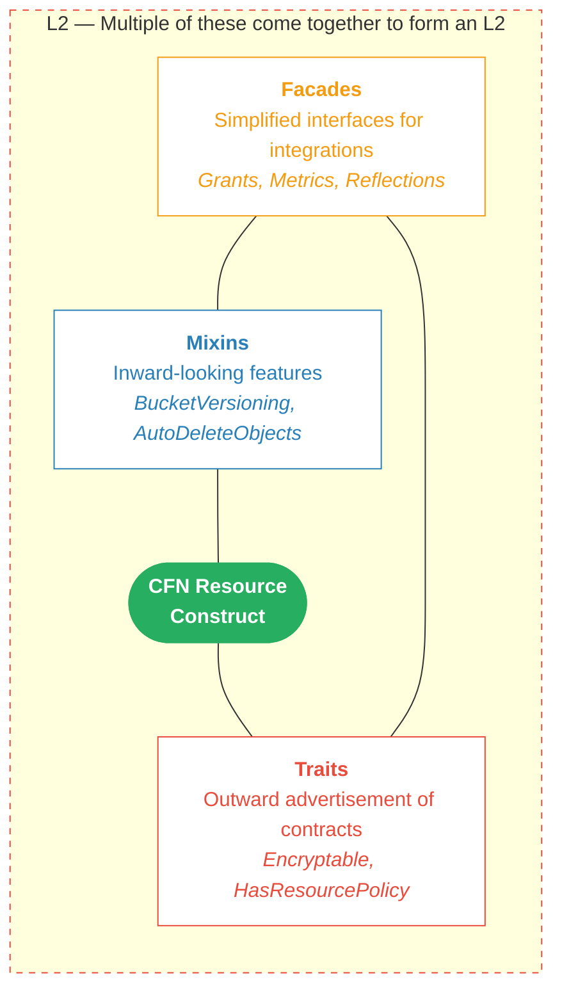

# Mixins, Facades, and Traits

> Design document for the composable building blocks of the AWS Construct Library.

## Overview

The AWS Construct Library uses three composable building blocks to provide
functionality around CFN Resource Constructs: **Mixins**, **Facades**, and
**Traits**. Together with the CFN Resource itself, these building blocks form
an L2 construct.

> [!NOTE]
> Historically the AWS Construct Library followed a different approach, using
> sophisticated L2 abstractions designed as opaque wrappers around L1 resources.
> While today much of existing code still follows this outdated design, the
> design discussed in here is the current state of the art.



Each building block has a distinct role and can be used independently of an L2.
This design enables users to compose features without being locked into specific
L2 implementations, and allows the same abstractions to work across L1, L2, and
custom constructs.

## Motivation

The traditional CDK architecture forced an "all-or-nothing" choice between
sophisticated L2 abstractions and comprehensive AWS coverage. This created
three unsustainable problems:

1. **Coverage treadmill**: L2s must be provided for all AWS services.
2. **Completeness treadmill**: each L2 must support every feature of the
   underlying resource.
3. **Customization treadmill**: all possible customizations must be supported.

By decomposing L2 functionality into Mixins, Facades, and Traits, each piece
is independently usable and composable. Users apply a Mixin to an L1 without
waiting for a full L2, use a Facade like Grants on any resource that advertises
the right Trait, and build custom L2s by composing these building blocks.

## Building Blocks

### Mixins

Mixins are **inward-looking features** that modify a resource's own
configuration. They are composable abstractions applied to constructs via the
`.with()` method from the `constructs` library.

Mixins operate on a single primary resource. While a mixin can create auxiliary
resources (like custom resource handlers) or accept other constructs as props,
it is not designed for integrations between two equally important resources
(e.g. connecting an SNS Topic to an SQS Queue). For those, use a Facade.

Mixins target L1 (`Cfn*`) resources. When applied to an L2 construct via
`.with()`, the mixin framework automatically delegates to the L1 default child.

**Key characteristics:**

- Extend the `Mixin` base class from `aws-cdk-lib/core`.
- Implement `supports(construct)` as a type guard and `applyTo(construct)`.
- Applied imperatively and immediately (in contrast to Aspects which are
  declarative and deferred).
- Live in a `lib/mixins/` subdirectory within their service module.
- Named after the resource they target (e.g. `BucketVersioning`, not
  `Versioning`).

**Examples:** `BucketVersioning`, `BucketAutoDeleteObjects`,
`BucketBlockPublicAccess`, `ClusterSettings`.

**When to use:**

- A feature modifies the resource's own configuration.
- The feature should work with both L1 and L2 constructs.
- The feature involves creating auxiliary resources (custom resources, policies).
- Users should be able to compose features independently of L2 props.

**When not to use:**

- The feature integrates the resource with something external (use a Facade).
- The feature advertises a capability to other constructs (use a Trait).
- You need to change the optionality of properties or change defaults (Mixins
  cannot do this).

For detailed implementation guidelines, see
[docs/MIXINS_DESIGN_GUIDELINES.md](../docs/MIXINS_DESIGN_GUIDELINES.md).

### Facades

Facades are **resource-specific simplified interfaces that provide
integrations** for a resource with other things. They are standalone classes
with a static factory method that accepts a resource reference interface.

Facades are always specific to a particular resource type — that is why it is
`BucketGrants` and not just `Grants`. While Facades for different resources look
similar, each contains resource-specific logic (e.g. `BucketGrants` knows about
object key patterns, `TopicGrants` does not).

Some Facades are auto-generated and available for most resources (e.g.
`BucketMetrics`, `BucketReflection`). Others are handwritten for resources that
need custom logic (e.g. `BucketGrants`). Because Facades are standalone classes
that only depend on the resource reference interface, third-party packages can
provide their own Facades for any resource without modifying `aws-cdk-lib`.

**Key characteristics:**

- Standalone classes, not part of the construct hierarchy.
- Always specific to one resource type.
- Have a static factory method (e.g. `BucketGrants.fromBucket(bucket)`).
- Accept the resource reference interface (`IBucketRef`), enabling use with
  both L1 and L2 constructs.
- Exposed as properties on the construct interface (e.g. `readonly grants`).
- Do not modify the resource's own configuration.

**Examples:** `BucketGrants`, `TopicGrants`, `BucketMetrics`, `BucketReflection`

**When to use:**

- The feature provides an integration between a specific resource and something
  external (IAM permissions, CloudWatch metrics, event patterns).
- The feature should work with both L1 and L2 constructs.
- The feature does not modify the resource itself.

### Traits

Traits are **service-agnostic contracts** that describe a capability any
resource can have. They allow Facades and other constructs to discover
capabilities of a resource without requiring a full L2 implementation.

Unlike Facades which are specific to one resource type, Traits are generic.
`IResourceWithPolicyV2` can represent _any_ resource that has a resource
policy — a bucket, a queue, a topic, or a custom resource. This is the key
distinction: Facades know about a specific resource, Traits know about a
capability that many resources share.

#### How Traits work

A Trait consists of two parts:

1. A **trait interface** that describes a capability (e.g. `IResourceWithPolicyV2`
   describes "this resource has a resource policy that can be modified", and
   `IEncryptedResource` describes "this resource is encrypted with a KMS key").
2. A **trait factory** that wraps an L1 resource into an object implementing the
   trait interface (e.g. `IResourcePolicyFactory` produces `IResourceWithPolicyV2`,
   and `IEncryptedResourceFactory` produces `IEncryptedResource`).

Trait factories are registered per CloudFormation resource type in a static
registry. When a Facade (like `BucketGrants`) encounters a resource, it looks
up the registry to discover what capabilities the resource has.

#### Current Traits

The CDK currently has two Traits:

| Trait interface         | Factory interface           | Registry               | Purpose                      |
| ----------------------- | --------------------------- | ---------------------- | ---------------------------- |
| `IResourceWithPolicyV2` | `IResourcePolicyFactory`    | `ResourceWithPolicies` | Resource policy manipulation |
| `IEncryptedResource`    | `IEncryptedResourceFactory` | `EncryptedResources`   | KMS key grants               |

The CDK provides default factory implementations for common L1 resources. For
example, `CfnBucket` has a registered `IResourcePolicyFactory` that knows how
to create and attach a `CfnBucketPolicy`.

#### Registering a Trait

To register a Trait for a CloudFormation resource type, use the static
`register()` method on the registry class:

```ts
import { CfnResource } from 'aws-cdk-lib';
import { IResourcePolicyFactory, IResourceWithPolicyV2, PolicyStatement, ResourceWithPolicies } from 'aws-cdk-lib/aws-iam';
import { Construct } from 'constructs';

declare const scope: Construct;

class MyResourcePolicyFactory implements IResourcePolicyFactory {
  forResource(resource: CfnResource): IResourceWithPolicyV2 {
    return {
      env: resource.env,
      addToResourcePolicy(statement: PolicyStatement) {
        // implementation to add the statement to the resource policy
        return { statementAdded: true, policyDependable: resource };
      }
    };
  }
}

ResourceWithPolicies.register(scope, 'AWS::My::Resource', new MyResourcePolicyFactory());
```

After registration, any Facade that uses `ResourceWithPolicies.of(resource)`
(such as a Grants class) automatically discovers and uses the factory when it
encounters a `CfnResource` of that type.

#### Consuming Traits in Facades

Facades use the registry classes to discover Traits on resources:

```ts
export class MyResourceGrants {
  public static fromMyResource(resource: IMyResourceRef): MyResourceGrants {
    return new MyResourceGrants(
      resource,
      EncryptedResources.of(resource),    // discovers IEncryptedResource if available
      ResourceWithPolicies.of(resource),  // discovers IResourceWithPolicyV2 if available
    );
  }

  private constructor(
    private readonly resource: IMyResourceRef,
    private readonly encryptedResource?: IEncryptedResource,
    private readonly policyResource?: IResourceWithPolicyV2,
  ) {}

  public read(grantee: IGrantable): Grant {
    const result = this.policyResource
      ? Grant.addToPrincipalOrResource({ /* ... */ resource: this.policyResource })
      : Grant.addToPrincipal({ /* ... */ });

    // if the resource is encrypted, also grant key permissions
    this.encryptedResource?.grantOnKey(grantee, 'kms:Decrypt');

    return result;
  }
}
```

This pattern is how `BucketGrants`, `TopicGrants`, and other Grants classes
work. The Trait system makes it possible for the same Grants class to work with
both L1 and L2 constructs — L2s implement the trait interfaces directly, while
L1s have their traits discovered through the factory registry.

#### When to use Traits

- A resource has a capability that Facades need to discover (e.g. "this
  resource has a resource policy", "this resource is encrypted with a KMS key").
- You are building a Facade that needs to work with L1 constructs and needs
  to discover capabilities dynamically.
- You are adding support for a new CloudFormation resource type to an existing
  Facade (register a factory for the new type).

#### When not to use Traits

- The capability is specific to a single Facade and does not need to be
  discovered dynamically (just implement it directly in the Facade).
- The feature modifies the resource itself (use a Mixin).

## How They Work Together

An L2 construct like `s3.Bucket` is a composition of these building blocks:

1. A **CFN Resource** (`CfnBucket`) at its core.
2. **Mixins** applied to configure the resource (versioning, auto-delete, etc.).
3. **Facades** exposed on the interface (grants, metrics, events).
4. **Traits** registered for the CFN resource type (encryptable, has resource policy).

> [!IMPORTANT]
> Each building block can be used independently of an L2. This is the key
> advantage — users do not need to wait for a full L2 to get access to
> sophisticated abstractions.

Users can use these building blocks independently:

```ts
// Use Mixins directly on an L1
const bucket = new s3.CfnBucket(this, 'Bucket')
  .with(new s3.mixins.BucketVersioning())
  .with(new s3.mixins.BucketBlockPublicAccess());

// Use a Facade directly on an L1
const grants = BucketGrants.fromBucket(bucket);
grants.read(role);

// Or use the full L2 which composes everything
const l2Bucket = new s3.Bucket(this, 'Bucket', {
  versioned: true,
  blockPublicAccess: s3.BlockPublicAccess.BLOCK_ALL,
});
l2Bucket.grants.read(role);
```

## Relationship to Existing L2 Constructs

Mixins, Facades, and Traits are additive. Existing L2 constructs continue to
work unchanged. Some L2 implementations have already been refactored to use
Mixins internally (e.g. `autoDeleteObjects` on `s3.Bucket` delegates to the
`BucketAutoDeleteObjects` mixin), but the L2 API remains stable.

### L2s are L1 + Mixins + Facades + Traits + Defaults

Conceptually, an L2 construct is the sum of its building blocks: an L1
resource, Mixins that configure it, Facades that integrate it, Traits that
advertise its capabilities, and sensible defaults that make it easy to use out
of the box.

In practice, L2s are not yet structurally identical to this formula. L2s still
contain glue code that wires the building blocks together: mapping L2 props to
L1 properties, instantiating the right Mixins based on prop values, exposing
Facades on the interface, and registering Traits. This glue code is necessary
but should not contain any functionality of its own — all actual behavior lives
in the building blocks.

> [!NOTE]
> If you find yourself writing logic in the L2 glue code that does more than
> map props, apply defaults, and wire building blocks, that logic should be
> extracted into a Mixin or Facade instead.

### Preferred approach for new features

1. Implement the feature as a Mixin (if it modifies the resource) or a Facade
   (if it integrates with external things).
2. Optionally expose the feature through the L2 construct's props or interface
   for convenience, delegating to the Mixin or Facade internally.
3. Register Traits as needed to enable Facades to discover capabilities on L1s.

Legacy L2 constructs have more flexibility and may retain their current
implementation patterns. The Mixins-first approach is primarily for new
development.

## References

- [RFC 0814: CDK Mixins](https://github.com/aws/aws-cdk-rfcs/blob/main/text/0814-cdk-mixins.md)
- [Design Guidelines: Mixins, Facades, and Traits](../docs/DESIGN_GUIDELINES.md#mixins-facades-and-traits)
- [Mixins Design Guidelines](../docs/MIXINS_DESIGN_GUIDELINES.md)
