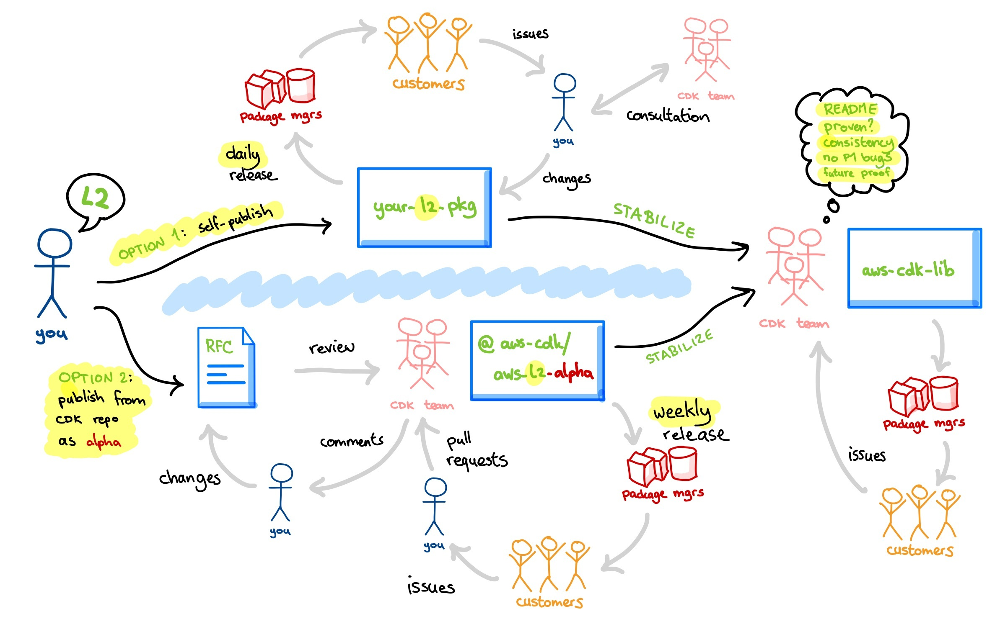

# New Constructs Creation Guide

By design and convention, `aws-cdk-lib` contains [different "levels" of constructs](https://github.com/aws/aws-cdk/blob/e4fdb0217edd7ecccdd4cbc20de958e3ba1a2349/docs/DESIGN_GUIDELINES.md?plain=1#L123-L188). Since L1 constructs are auto-generated from the [AWS CloudFormation resource specification](https://docs.aws.amazon.com/AWSCloudFormation/latest/UserGuide/cfn-resource-specification.html), new resources are automatically released when a new version of the specification is consumed. However, higher level constructs, such as L2 and L3 constructs, are written by hand and therefore do not currently cover 100% of the resources available in cloudformation.

Depending on demand from the community, developers at aws from the aws-cdk team or any other team may contribute L2 constructs that were previously not defined. Additionally, a lot of times users of the aws-cdk from outside of AWS are using a service that currently has no L2 constructs and may wish to create these constructs for themselves and others to use.

If you wish to create new L2 (or potentially L3) constructs, this guide can help you get started.

## Do My Constructs Belong in aws-cdk-lib?

Users of the aws-cdk can use constructs from a number of packages within their application. `aws-cdk-lib` and/or any of the other constructs vended from npm, maven, pypi, nuget, or GitHub (for go) that are publicly available are indexed and searchable on [Construct Hub](constructs.dev). Anyone can create and publish new constructs that will be indexed on Construct Hub using repositories and packages that they own. However, if you believe your constructs should be part of the core aws construct library, here are some guidelines that they must adhere to.

1. They meet the definition of [L2 constructs](https://github.com/aws/aws-cdk/blob/e4fdb0217edd7ecccdd4cbc20de958e3ba1a2349/docs/DESIGN_GUIDELINES.md?plain=1#L139-L147)
1. They follow the relevant [design guidelines](https://github.com/aws/aws-cdk/blob/main/docs/DESIGN_GUIDELINES.md)
1. They can follow the aws-cdk's versioning and release strategy, ie: if they are to be vended in aws-cdk-lib they must be stable or instead be vended in an `-alpha` package.
1. They provide constructs for a service that intersect with core aws usage patterns. For example, IAM, Lambda, EC2, DynamoDB, RDS, etc. 100% L2 coverage of every AWS service is not a goal of aws-cdk-lib.

If your constructs do not meet these guidelines, see the [publishing your own package](#publishing-your-own-package) section of this guide, otherwise, you may choose to [publish your own package](#publishing-your-own-package) or [open a PR to aws-cdk-lib](#open-a-pr-to-aws-cdk-lib).

## Publishing Your Own Package

Whether you want to pursue inclusion of your new constructs in aws-cdk-lib or not, the easiest way to get started is to create your own package. This will allow you to create, publish, test, and gather feedback on your new constructs as fast as possible without waiting for the aws cdk team to review the design and implementation of them. This also will allow you to deviate from the design and conventions of `aws-cdk-lib` if you wish to explore a more experimental or alternative api design. This also will enable you to gather feedback from users, make additions and changes, including breaking changes, without worrying about the versioning and support lifecycle of `aws-cdk-lib`.

To get started creating your own construct package, we recommend using [`projen`](https://github.com/projen/projen). Additionally you can follow [this guide](https://dev.to/aws-builders/a-beginner-s-guide-to-create-aws-cdk-construct-library-with-projen-5eh4) which will help you setup your repository, packages and tooling step by step.

Once your constructs have been published for some time and you feel that the apis are stable and bugs have been identified, you can continue to distribute it as a separate package and/or attempt to add them to `aws-cdk-lib` via a PR.

## Open a PR to `aws-cdk-lib`

You can [create a PR](https://github.com/aws/aws-cdk/compare) in the `aws/aws-cdk` repository with your constructs at any time if you believe they are ready for inclusion. Here are some cases where opening a PR directly without publishing your own package first is ideal.

1. It is a small addition to a service that has had stable L2 constructs for some time
1. The service usage is well known and the API is unlikely to change.
1. The defaults provided by the L2 are well known best practice

If all of the above are true and your constructs adhere to [the relevant guidelines](#do-my-constructs-belong-in-aws-cdk-lib), we encourage you to follow the [contributing guide](../CONTRIBUTING.md) and create a new pull request. Specifically, see the section on within the [Design](../CONTRIBUTING.md#step-2-design) section. Since the bandwidth of the aws-cdk team is limited, reviews and iteration may take some time. Additionally pull requests for new constructs are more likely to be accepted if they have any of the following:

1. An existing package with users who have used and tested the Constructs and provided feedback
1. Strong documentation
1. Good unit and integration test coverage

## New Construct Development lifecycle

Whether publishing your own package or making a PR against aws-cdk-lib immediately, the following is the recommended lifecycle for new construct development.

### Self Publishing
1. Publish: design, write, and publish your new constructs
1. Iterate: respond to issues from users, fix bugs, optimize usage patterns and gain consensus
1. Stabilize: settle on the api
*Optionally*
1. Upstream: open a PR to aws-cdk-lib to include if still relevant

### Alpha CDK Package
1. Design: create a draft PR with the new README detailing the API, socialize, and gain consensus
1. Implement: write the construct as designed and create a new pull requests
1. Iterate: respond to feedback from pull request reviewers on the aws-cdk team
1. Publish: publish your new constructs as an alpha module
1. Iterate: respond to issues from users, fix bugs and optimize usage patterns
1. Stabilize: settle on the api and create a new PR migrating all constructs stability to "stable"
