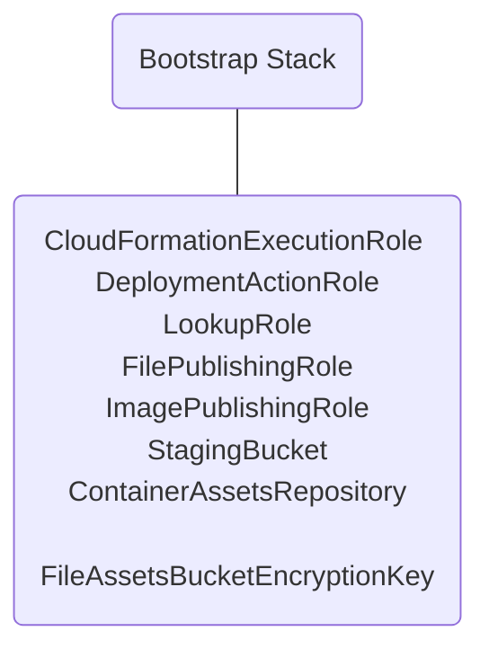
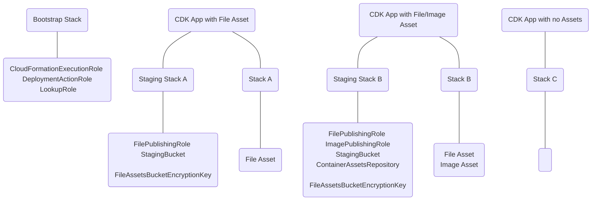

# App Scoped Staging Synthesizer
<!--BEGIN STABILITY BANNER-->

---


> The APIs of higher level constructs in this module are experimental and under active development.
> They are subject to non-backward compatible changes or removal in any future version. These are
> not subject to the [Semantic Versioning](https://semver.org/) model and breaking changes will be
> announced in the release notes. This means that while you may use them, you may need to update
> your source code when upgrading to a newer version of this package.

---

<!--END STABILITY BANNER-->

This library includes constructs aimed at replacing the current model of bootstrapping and providing
greater control of the bootstrap experience to the CDK user. The important constructs in this library
are as follows:

- the `IStagingResources` interface: a framework for an app-level bootstrap stack that handles
  file assets and docker assets.
- the `DefaultStagingStack`, which is a works-out-of-the-box implementation of the `IStagingResources`
  interface.
- the `AppStagingSynthesizer`, a new CDK synthesizer that will synthesize CDK applications with
  the staging resources provided.

## Bootstrap Model

Our current bootstrap model looks like this, when you run `cdk bootstrap aws://<account>/<region>` :



Your CDK Applicaiton utilizes some of these resources when deploying. For example, if you have a file asset,
it gets uploaded to the `StagingBucket` using the `FilePublishingRole` when you run `cdk deploy`.

This library introduces an alternate model to bootstrapping, by splitting out essential CloudFormation iam roles
and staging resources. There will still be a Bootstrap Stack, but this will only contain IAM roles necessary for
CloudFormation deployment. Each CDK App will instead be in charge of it's own staging resources, including the
S3 Bucket, ECR Repositories, and associated IAM roles. It works like this:

The Staging Stack will contain, on a per-need basis, 

- 1 S3 Bucket with KMS encryption for all file assets in the CDK App.
- An ECR Repository _per_ image (and its revisions).
- IAM roles with access to the Bucket and Repositories.



This allows staging resources to be created when needed next to the CDK App. It has the following
benefits:

- Bootstrapping will be faster since the heavy resource of a KMS key is no longer involved.
- Because roles are a global resource, every account now only needs to be bootstrapped once.
- Users have a familiar way to customize staging resources in the CDK Application.

> As this library is `experimental`, the accompanying Bootstrap Stack is not yet implemented. To use this
> library right now, you must reuse roles that have been traditionally bootstrapped.

## Synthesizer

To use this library, supply the `AppStagingSynthesizer` in as the default synthesizer to the app.
This will ensure that a Staging Stack will be created next to the CDK App to hold the staging resources.

`AppStagingSynthesizer` comes with static methods covering the use-cases for the synthesizer. 

### Using the Default Staging Stack per Environment

The most common use case will be to use the built-in default resources. In this scenario, the
synthesizer will create a new Staging Stack in each environment the CDK App is deployed to store
its staging resources. To use this kind of synthesizer, use `AppStagingSynthesizer.defaultResources()`.

```ts
const app = new App({
  defaultSynthesizer: AppStagingSynthesizer.defaultResources({
    appId: 'my-app-id',
  }),
});
```

Every CDK App that uses the `DefaultStagingStack` must include an `appId`. This should
be an identifier unique to the app and is used to differentiate staging resources associated
with the app.

### Using a Custom Staging Stack per Environment

Use `AppStagingSynthesizer.customFactory()` to supply a custom staging stack on a per-environment basis.
This has the benefit of providing a custom Staging Stack that can be created in every environment the CDK App
is deployed to.

```ts
import { IStagingResources } from '@aws-cdk/app-staging-synthesizer';

class CustomStagingStack extends Stack implements IStagingResources {
  // ...
}

const app = new App({
  defaultSynthesizer: AppStagingSynthesizer.customFactory({
    factory: {
      obtainStagingResources(stack, context) {
        const app = App.of(stack);
        if (!App.isApp(app)) {
          throw new Error(`Stack ${stack.stackName} must be part of an App`);
        }

        return new CustomStagingStack(app, `CustomStagingStack-${appId}-${context.environmentString}`, { appId: 'my-app-id' }),
      },
    },
    oncePerEnv: true, // by default
  }),
});
```

### Using an Existing Staging Stack

Use `AppStagingSynthesizer.customResources()` to supply an existing stack as the Staging Stack.
Make sure that the custom stack you provide implements `IStagingResources`.

```ts
import { IStagingResources } from '@aws-cdk/app-staging-synthesizer';

class CustomStagingStack extends Stack implements IStagingResources {
  // ...
}

const resourceApp = new App();
const resources = new CustomStagingStack(resourceApp, 'CustomStagingStack');

const app = new App({
  defaultSynthesizer: AppStagingSynthesizer.customResources({
    resources,
  }),
});
```

## Default Staging Stack

The Default Staging Stack includes all the staging resources necessary for CDK Assets. The below example
is of a CDK App using the `AppStagingSynthesizer` and creating a file asset for the Lambda Function
source code. As part of the `DefaultStagingStack`, an S3 bucket and IAM role will be created that will be
used to upload the asset to S3.

```ts
import * as path from 'path';
import * as lambda from 'aws-cdk-lib/aws-lambda';

const app = new App({
  defaultSynthesizer: new AppStagingSynthesizer.defaultResources({ appId: 'my-app-id' }),
});

const stack = new Stack(app, 'my-stack');

new lambda.Function(stack, 'lambda', {
  code: lambda.AssetCode.fromAsset(path.join(__dirname, 'assets')),
  handler: 'index.handler',
  runtime: lambda.Runtime.PYTHON_3_9,
});

app.synth();
```

### Custom Roles

You can customize some or all of the roles you'd like to use in the synthesizer as well,
if all you need is to supply custom roles (and not change anything else in the `DefaultStagingStack`):

```ts
const app = new App({
  defaultSynthesizer: new AppStagingSynthesizer.defaultResources({
    appId: 'my-app-id',
    deploymentRoles: {
      cloudFormationExecutionRole: BoostrapRole.fromRoleArn('arn:aws:iam::123456789012:role/Execute'),
      deploymentActionRole: BootstrapRole.fromRoleArn('arn:aws:iam::123456789012:role/Deploy'),
      lookupRole: BoostrapRole.fromRoleArn('arn:aws:iam::123456789012:role/Lookup'),
    },
  }),
});
```

Or, you can ask to use the CLI credentials that exist at deploy-time:

```ts
const app = new App({
  defaultStackSynthesizer: AppStagingSynthesizer.defaultResources({
    appId: 'my-app-id',
    deploymentRoles: {
      cloudFormationExecutionRole: BootstrapRole.cliCredentials(),
      lookupRole: BootstrapRole.cliCredentials(),
      deploymentRole: BootstrapRole.cliCredentials(),
    },
  }),
});
```

You can also specify an existing IAM role for the `fileAssetPublishingRole` or `imageAssetPublishingRole`:

```ts
const app = new App({
  defaultStackSynthesizer: AppStagingSynthesizer.defaultResources({
    appId: 'my-app-id',
    fileAssetPublishingRole: BootstrapRole.fromRoleArn('arn:aws:iam::123456789012:role/S3Access'), 
    imageAssetPublishingRole: BootstrapRole.fromRoleArn('arn:aws:iam::123456789012:role/ECRAccess'),
  }),
});
```

### Ephemeral S3 Assets

Some assets that get put into the staging S3 Bucket are ephemeral - they are only necessary
during CloudFormation deployment and not after. As long as you know what assets are ephemeral,
you can tag them as such and they will be marked with an `handoff/` prefix when they are staged.
This allows configuration of a lifecycle rule specifically for ephemeral assets.

A good example is a Lambda Function asset. The asset is only useful in the S3 Bucket at deploy
time, because the source code gets copied into Lambda itself. So we can mark Lambda assets
as ephemeral:

```ts
new lambda.Function(stack, 'lambda', {
  code: lambda.AssetCode.fromAsset(path.join(__dirname, 'assets'), {
    ephemeral: true,
  }),
  handler: 'index.handler',
  runtime: lambda.Runtime.PYTHON_3_9,
});
```

This means that the asset will go into the S3 Bucket with the prefix `handoff/`. It will also be 
subject to the lifecycle rule set on ephemeral assets. By default, we store ephemeral assets for
30 days.

```ts
const app = new App({
  defaultStackSynthesizer: TestAppScopedStagingSynthesizer.defaultResources({
    appId: 'my-app-id',
    handoffFileAssetLifetime: Duration.days(100),
  }),
});
```

### Lifecycle Rules on ECR Repositories

### Extending the Default Staging Stack
