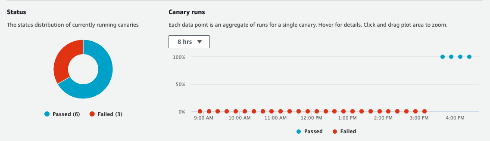

## Amazon CloudWatch Synthetics Construct Library

<!--BEGIN STABILITY BANNER-->
---


> All classes with the `Cfn` prefix in this module ([CFN Resources](https://docs.aws.amazon.com/cdk/latest/guide/constructs.html#constructs_lib)) are always stable and safe to use.


> The APIs of higher level constructs in this module are experimental and under active development. They are subject to non-backward compatible changes or removal in any future version. These are not subject to the [Semantic Versioning](https://semver.org/) model and breaking changes will be announced in the release notes. This means that while you may use them, you may need to update your source code when upgrading to a newer version of this package.

---
<!--END STABILITY BANNER-->

Amazon CloudWatch Synthetics allow you to monitor your application by generating **synthetic** traffic. The traffic is produced by a **canary**. A canary is a configurable script that runs on a schedule. You configure the canary script to follow the same routes and perform the same actions as a customer, which allows you to continually verify your customer experience even when you don't have any customer traffic on your applications.

## Canary

To illustrate how to use a canary, assume your application defines the following endpoint:

```bash
curl https://api.awsomesite.com/user/books/topbook/
The Hitchhikers Guide to the Galaxy

```

The below code defines a canary that will hit the `books/topbook` endpoint every 5 minutes:

```ts
const canary = new Canary(this, 'MyCanary', {
  name: 'mycanary'
  schedule: Schedule.Rate(Duration.minutes(1)),
  handler: 'index.handler',
  code: synth.Code.fromInline(
    `const https = require('https');
     var synthetics = require('Synthetics');
     const log = require('SyntheticsLogger');
  
     exports.handler = async function () {
      const requestOptions = {"hostname":"api.awsomesite.com","method":"","path":"/user/books/topbook/","port":443}
      let req = https.request(requestOptions);
      req.on('response', (res) => {
        log.info()
      });
     }`
    )
});
```

The canary will automatically produce a CloudWatch Dashboard:



### Alarms

You can configure a CloudWatch Alarm on canary metrics. Metrics are emitted by CloudWatch automatically and can be accessed by the following APIs:
- `canary.metricSuccessPercent()`
- `canary.metricDuration()`
- `canary.metricFailed()`

To configure an alarm use the `createAlarm()` method:
```ts

canary.createAlarm('CanaryAlarm', {
  metric: canary.metricSuccessPercent(),
  evaluationPeriods: 2,
  threshold: 90,
  comparisonOperator: cloudwatch.ComparisonOperator.LESS_THAN_THRESHOLD,
})
```

### Code

As your application becomes more complex you may want a canary that executes code requiring multiple files and/or dependencies. To include code from a local directory, use the `Code.fromAsset()` method:

```ts
const canary = new synth.Canary(this,'mycanary',{
  name: 'mycanary'
  schedule: Schedule.Rate(Duration.minutes(1)),
  handler: 'index.handler',
  code: synth.Code.fromAsset('./scripts'),
});
```

You can specify a zip file or a directory as the asset. If you specify a directory the CDK will zip it for you. You can read more about the `assets` mechanism [here](https://github.com/aws/aws-cdk/tree/master/packages/%40aws-cdk/aws-s3-assets).

Alternatively you can reference a zip file from an S3 bucket:

```ts
const canary = new synth.Canary(this,'mycanary',{
  name: 'mycanary'
  schedule: Schedule.Rate(Duration.minutes(1)),
  handler: 'index.handler',
  code: synth.Code.fromBucket(bucket, key[, objectVersion]),
});
```

#### Canary Code Problem & Point of Contention

Canary scripts `fromAsset()` or `fromBucket` must have a fixed structure, that is, the zip file or directory must include `nodejs/node_modules` in its path. The canary will successfully deploy without this structure but fail to execute.

**Possible Solutions**

  - Check for the `nodejs/node_modules` structure at `synth` time and throw an error if it does not exist.
    
    Pros:
      - Very simple implementation and removes the customer struggle to figure out why the canary is failing.
      - Alerts the customer of the required path and allows them to create the necessary structure.
      - Perhaps all that is necessary for an initial L2 Construct.
      
    Cons:
      - Does the bare minimum for the customer and exposes this sharp edge of the resource.
      
  - Create and copy files into the `nodejs/node_modules` structure at `synth` time, and then continue to update the copied files at `synth`.
    
    Pros:
      - Implementation will not require changing other modules.
      - Customers can continue to reference their local canary scripts as they would their lambda functions.
    
    Cons:
      - Causes confusion for the customer and they may not know whether to change the original file or the copied file in the future.
      - Does not give an explanation of why this is needed.
      - Copied files get created at `synth` time.
      
  - Append the required `nodejs/node_modules` structure to the zip file at `build` time.
  
    Pros:
      - Does not expose the `nodejs/node_modules` requirement to the user at all.
      - No confusing folders/files are added to the local repository at `synth` time
      - The result would make canary `code.fromAsset()` work no different than how lambda `code.fromAsset()` works.
      
    Cons:
      - Implementation would likely involve changing the `name` in [cdk-assets](https://github.com/aws/aws-cdk/blob/16d2a48a4d0e049d0ae6cd8c9165eccc816ebd4b/packages/cdk-assets/lib/private/archive.ts#L37) for canaries through an optional property. Basically a more involved implementation as it requires changing code in cdk-assets.

### Canary Cfn Property Implementation Choices

Below is a list of Canary Cfn Properties and the proposed implementation in the L2 construct:

- `artifactS3Location: string` -- `artifactS3Location?: string`, will create a new s3 bucket for the customer by default.

- `code: Code` -- already deliberated in above 'Code' section.

- `executionRoleArn: string` -- `role?: iam.IRole`, will create a new role with necessary permissions by default, but specified roles must come with correct permissions.

- `failureRetentionPeriod?: number` -- `failureRetentionPeriod?: cdk.Duration`, defaults to 31 days.

- `successRetentionPeriod?: number` -- `successRetentionPeriod?: cdk.Duration`, defaults to 31 days.

- `name: string` -- `canaryName: string`. Cloudformation does not generate a name for a canary so this stays required.

- `runConfig: {memoryInMB?: number, timeoutInSeconds: number}` -- Split into two properties: `memorySize?: number` and `timeout?: Duration`. These properties are modeled after the underlying lambda function which has the same properties in the L2 construct. `timeout` defaults to the rate of `schedule` or 900 seconds, whichever is smaller.

- `runtimeVersion: string` -- There is only one runtime version, `syn-1.0`, so this is hardcoded into the construct and not an exposed property.

- `schedule: {durationInSeconds?: number, expression: string}` -- Split into two properties: `lifetime?: Duration`, and `schedule: Schedule`. The `durationInSeconds` property determines how long the canary is active, therefore, it seems more appropriate to call it `lifetime` and default to `0`= forever. The `Schedule` class is similar to what exists in the autoscaling construct, where the user can specify many ways to describe an `expression`.

- `startCanaryAfterCreation: boolean` -- `enableCanary?: boolean`, defaults to true.

- `tags?: Tag[]` -- not implemented in favor of `Tag` class.

- `vpcConfig?: {securityGroupIds: string[], subnetIds: string[], vpcId?: string}` -- Split into the three properties `securityGroups?: ec2.ISecurityGroup[]`, `vpcSubnets?: ec2.SubnetSelection`, `vpc?: ec2.IVpc`. This is similar to how lambda implements `vpcConfig`.
  
### Future Work + Notes

- The Canary UI specifies a set of 3 blueprints to choose from and it would be nice if the L2 could do the same.
- We can generate a random `name` for the customer and optionalize the `canaryName` property.
- Deleting a canary does not actually delete the underlying resources, i.e. the lambda function/layers, s3 buckets where canary results are stored, etc.

