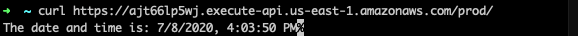

## AWS::Synthetics Construct Library

<!--BEGIN STABILITY BANNER-->
---


> All classes with the `Cfn` prefix in this module ([CFN Resources](https://docs.aws.amazon.com/cdk/latest/guide/constructs.html#constructs_lib)) are always stable and safe to use.

---
<!--END STABILITY BANNER-->

Amazon CloudWatch Synthetics allow you to monitor your application by continuously generating **synthetic** traffic. This traffic is generated by a **canary** which will hit your endpoint as if it were a customer, allowing you to verify the health of your endpoint.

## Creating a Canary

Every time a canary runs, it executes a supplied script which defines the code that hits your endpoint. For example, if you have an API gateway endpoint: 

```ts
const backend = new lambda.Function(...);
new apigateway.LambdaRestApi(this, 'dateReturner', {
  handler: backend,
});
```

The api gateway exposes the following url: example.com/date.



A canary can be used to monitor this endpoint. 

```ts
const canary = new Canary(this, 'my_test', {
  canaryName: 'date-endpoint-canary',
  handler: 'index.handler',
  code: Code.fromInline('// The code that hits 'example.com/date' goes here'),
  schedule: Schedule.Rate(Duration.seconds(1)),
});
```

The canary will automatically produce this CloudWatch Dashboard:


Canaries can be used to monitor architecture at any level of complexity, from a simple endpoint to a complete website. This level of complexity is determined by the script it runs, and you can customize it to fit your application's needs.

### Adding an Alarm to your Canary

You can configure a CloudWatch Alarm on canary metrics. Metrics are emitted by CloudWatch automatically and can be accessed by the following APIs:
- `canary.metricSuccessPercent(props?)`
- `canary.metricDuration(props?)`
- `canary.metricFailed(props?)`

```ts
const canary = new synth.Canary(this,'mycanary',{
  handler: 'index.handler',
  canaryName: 'mycanary',
  code: synth.Code.fromInline('foo'),
});

canary.createAlarm('CanaryAlarm', {
  metric: canary.metricSuccessPercent(),
  evaluationPeriods: 2,
  threshold: 90,
  comparisonOperator: cloudwatch.ComparisonOperator.LESS_THAN_THRESHOLD,
})
```

### Canary Code

In addition to `Code.fromInline()`, you can use `Code.fromAsset(path)` or `Code.fromBucket(bucket,key)` for more complicated use cases:

```ts
// Code.fromAsset()
const canary = new synth.Canary(this,'mycanary',{
  handler: 'index.handler',
  canaryName: 'mycanary',
  code: synth.Code.fromAsset('./scripts'),
});

// Code.fromBucket()
const canary = new synth.Canary(this,'mycanary',{
  handler: 'index.handler',
  canaryName: 'mycanary',
  code: synth.Code.fromBucket(bucket, key),
});
```

- `Code.fromAsset(path)` - specify a directory or a .zip file in the local filesystem which will be zipped and uploaded to S3 before deployment. See also [bundling asset code](https://github.com/aws/aws-cdk/tree/master/packages/%40aws-cdk/aws-lambda#Bundling-Asset-Code). If the path does not contain the directories `nodejs/node_modules`, an error will be thrown explaining this requirement.
- `Code.fromBucket(bucket, key, objectVersion?)` - specify an S3 object that contains the archive of your runtime code. 

### Discussion + Future Work

- Modeling the `Schedule` property

  - Currently the Canary L1 takes a mandatory `Schedule` property that is an object with `DurationInSeconds` and `Expression` as sub-properties. `DurationInSeconds` specifies how long the canary should be active for and `Expression` defines how often the canary runs. I propose the L2 extracts `DurationInSeconds` from `Schedule` as `lifetime`. `Schedule` can be implemented in a similar fashion to autoscaling by exposing a static `rate(Duration)` method.
  
- `Code.fromAsset()` path

  - The problem is that the Canary resource requires imported code to be a zip file with the directory structure `nodejs/node_modules`. This causes pain for customers because this requirement is unclear and dissimilar to lambda (the other common `fromAsset()` implementation). Currently the API will throw an error if the directory structure is not there. Ideally this evolves to one of the following options:
    - The API will copy the files and append the `nodejs/node_modules` structure if it is missing at `synth` time. 
    - The API will add the `nodejs/node_modules` prefix at `build` time by modifying how `Asset` publishes directories. However, this implementation could alter how `assetHash` currently works.
