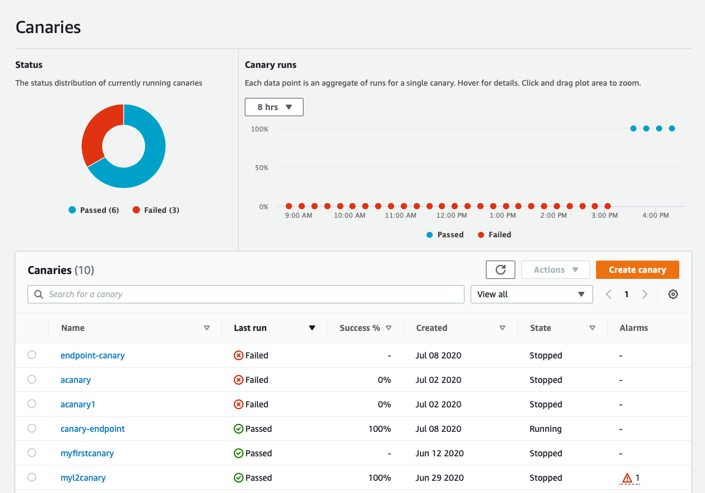

# Amazon CloudWatch Synthetics Construct Library
<!--BEGIN STABILITY BANNER-->

---


> All classes with the `Cfn` prefix in this module ([CFN Resources]) are always stable and safe to use.
>
> [CFN Resources]: https://docs.aws.amazon.com/cdk/latest/guide/constructs.html#constructs_lib


> The APIs of higher level constructs in this module are in **developer preview** before they
> become stable. We will only make breaking changes to address unforeseen API issues. Therefore,
> these APIs are not subject to [Semantic Versioning](https://semver.org/), and breaking changes
> will be announced in release notes. This means that while you may use them, you may need to
> update your source code when upgrading to a newer version of this package.

---

<!--END STABILITY BANNER-->

Amazon CloudWatch Synthetics allow you to monitor your application by generating **synthetic** traffic. The traffic is produced by a **canary**: a configurable script that runs on a schedule. You configure the canary script to follow the same routes and perform the same actions as a user, which allows you to continually verify your user experience even when you don't have any traffic on your applications.

## Canary

To illustrate how to use a canary, assume your application defines the following endpoint:

```console
% curl "https://api.example.com/user/books/topbook/"
The Hitchhikers Guide to the Galaxy

```

The below code defines a canary that will hit the `books/topbook` endpoint every 5 minutes:

```ts
import * as synthetics from '@aws-cdk/aws-synthetics';

const canary = new synthetics.Canary(this, 'MyCanary', {
  schedule: synthetics.Schedule.rate(Duration.minutes(5)),
  test: Test.custom({
    code: synthetics.Code.fromAsset(path.join(__dirname, 'canary')),
    handler: 'index.handler',
  }),
  runtime: synthetics.Runtime.SYNTHETICS_NODEJS_PUPPETEER_3_0,
});
```

The following is an example of an `index.js` file which exports the `handler` function:

```js
var synthetics = require('Synthetics');
const log = require('SyntheticsLogger');

const pageLoadBlueprint = async function () {

    // INSERT URL here
    const URL = "https://api.example.com/user/books/topbook/";

    let page = await synthetics.getPage();
    const response = await page.goto(URL, {waitUntil: 'domcontentloaded', timeout: 30000});
    //Wait for page to render.
    //Increase or decrease wait time based on endpoint being monitored.
    await page.waitFor(15000);
    // This will take a screenshot that will be included in test output artifacts
    await synthetics.takeScreenshot('loaded', 'loaded');
    let pageTitle = await page.title();
    log.info('Page title: ' + pageTitle);
    if (response.status() !== 200) {
        throw "Failed to load page!";
    }
};

exports.handler = async () => {
    return await pageLoadBlueprint();
};
```

> **Note:** The function **must** be called `handler`.

The canary will automatically produce a CloudWatch Dashboard:



The Canary code will be executed in a lambda function created by Synthetics on your behalf. The Lambda function includes a custom [runtime](https://docs.aws.amazon.com/AmazonCloudWatch/latest/monitoring/CloudWatch_Synthetics_Canaries_Library.html) provided by Synthetics. The provided runtime includes a variety of handy tools such as [Puppeteer](https://www.npmjs.com/package/puppeteer-core) (for nodejs based one) and Chromium.

To learn more about Synthetics capabilities, check out the [docs](https://docs.aws.amazon.com/AmazonCloudWatch/latest/monitoring/CloudWatch_Synthetics_Canaries.html).

### Configuring the Canary Script

To configure the script the canary executes, use the `test` property. The `test` property accepts a `Test` instance that can be initialized by the `Test` class static methods. Currently, the only implemented method is `Test.custom()`, which allows you to bring your own code. In the future, other methods will be added. `Test.custom()` accepts `code` and `handler` properties -- both are required by Synthetics to create a lambda function on your behalf.

The `synthetics.Code` class exposes static methods to bundle your code artifacts:

  - `code.fromInline(code)` - specify an inline script.
  - `code.fromAsset(path)` - specify a .zip file or a directory in the local filesystem which will be zipped and uploaded to S3 on deployment. See the above Note for directory structure.
  - `code.fromBucket(bucket, key[, objectVersion])` - specify an S3 object that contains the .zip file of your runtime code. See the above Note for directory structure.

Using the `Code` class static initializers:

```ts
// To supply the code inline:
const canary = new Canary(this, 'MyCanary', {
  test: Test.custom({
    code: synthetics.Code.fromInline('/* Synthetics handler code */'),
    handler: 'index.handler', // must be 'index.handler'
  }),
  runtime: synthetics.Runtime.SYNTHETICS_NODEJS_PUPPETEER_3_0,
});

// To supply the code from your local filesystem:
const canary = new Canary(this, 'MyCanary', {
  test: Test.custom({
    code: synthetics.Code.fromAsset(path.join(__dirname, 'canary')),
    handler: 'index.handler', // must end with '.handler'
  }),
  runtime: synthetics.Runtime.SYNTHETICS_NODEJS_PUPPETEER_3_0,
});

// To supply the code from a S3 bucket:
const canary = new Canary(this, 'MyCanary', {
  test: Test.custom({
    code: synthetics.Code.fromBucket(bucket, 'canary.zip'),
    handler: 'index.handler', // must end with '.handler'
  }),
  runtime: synthetics.Runtime.SYNTHETICS_NODEJS_PUPPETEER_3_0,
});
```

> **Note:** For `code.fromAsset()` and `code.fromBucket()`, the canary resource requires the following folder structure:
>
> ```plaintext
> canary/
> ├── nodejs/
>    ├── node_modules/
>         ├── <filename>.js
> ```
>
> See Synthetics [docs](https://docs.aws.amazon.com/AmazonCloudWatch/latest/monitoring/CloudWatch_Synthetics_Canaries_WritingCanary.html).

### Alarms

You can configure a CloudWatch Alarm on a canary metric. Metrics are emitted by CloudWatch automatically and can be accessed by the following APIs:

- `canary.metricSuccessPercent()` - percentage of successful canary runs over a given time
- `canary.metricDuration()` - how much time each canary run takes, in seconds.
- `canary.metricFailed()` - number of failed canary runs over a given time

Create an alarm that tracks the canary metric:

```ts
new cloudwatch.Alarm(this, 'CanaryAlarm', {
  metric: canary.metricSuccessPercent(),
  evaluationPeriods: 2,
  threshold: 90,
  comparisonOperator: cloudwatch.ComparisonOperator.LESS_THAN_THRESHOLD,
});
```

### Future Work

- Add blueprints to the Test class [#9613](https://github.com/aws/aws-cdk/issues/9613#issue-677134857).
