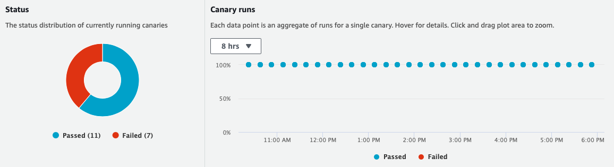

## Amazon CloudWatch Synthetics Construct Library

<!--BEGIN STABILITY BANNER-->
---


> All classes with the `Cfn` prefix in this module ([CFN Resources](https://docs.aws.amazon.com/cdk/latest/guide/constructs.html#constructs_lib)) are always stable and safe to use.


> The APIs of higher level constructs in this module are experimental and under active development. They are subject to non-backward compatible changes or removal in any future version. These are not subject to the [Semantic Versioning](https://semver.org/) model and breaking changes will be announced in the release notes. This means that while you may use them, you may need to update your source code when upgrading to a newer version of this package.

---
<!--END STABILITY BANNER-->

Amazon CloudWatch Synthetics allow you to monitor your application by generating **synthetic** traffic. The traffic is produced by a **canary**. A canary is a configurable script that runs on a schedule. You configure the canary script to follow the same routes and perform the same actions as a customer, which allows you to continually verify your customer experience even when you don't have any customer traffic on your applications.

## Canary

To illustrate how to use a canary, assume your application defines the following endpoint:

```bash
curl https://api.awsomesite.com/user/books/topbook/
The Hitchhikers Guide to the Galaxy

```

The below code defines a canary that will hit the `books/topbook` endpoint every 5 minutes:

```ts
const canary = new Canary(this, 'MyCanary', {
  name: 'mycanary'
  schedule: Schedule.Rate(Duration.minutes(1)),
  handler: 'index.handler',
  code: synth.Code.fromInline(
    `const https = require('https');
     var synthetics = require('Synthetics');
     const log = require('SyntheticsLogger');
  
     exports.handler = async function () {
      const requestOptions = {"hostname":"api.awsomesite.com","method":"","path":"/user/books/topbook/","port":443}
      let req = https.request(requestOptions);
      req.on('response', (res) => {
        log.info()
      });
     }`
    )
});
```

The canary will automatically produce a CloudWatch Dashboard:



### Alarms

You can configure a CloudWatch Alarm on canary metrics. Metrics are emitted by CloudWatch automatically and can be accessed by the following APIs:
- `canary.metricSuccessPercent()`
- `canary.metricDuration()`
- `canary.metricFailed()`

```ts

new cloudwatch.Alarm(this, 'CanaryAlarm', {
  metric: canary.metricSuccessPercent(),
  evaluationPeriods: 2,
  threshold: 90,
  comparisonOperator: cloudwatch.ComparisonOperator.LESS_THAN_THRESHOLD,
});
```

### Code

TBD
  
### Future Work + Notes

- We can generate a random `name` for the customer and optionalize the `canaryName` property.
- Deleting a canary does not actually delete the underlying resources, i.e. the lambda function/layers, s3 buckets where canary results are stored, etc.

