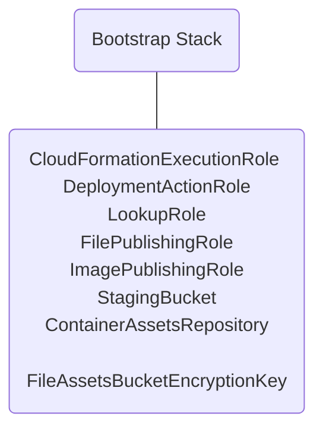
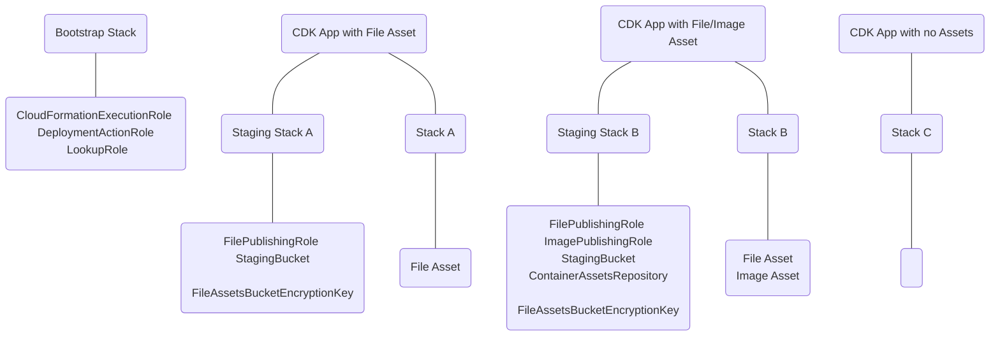

# App Scoped Staging Synthesizer
<!--BEGIN STABILITY BANNER-->

---


> The APIs of higher level constructs in this module are experimental and under active development.
> They are subject to non-backward compatible changes or removal in any future version. These are
> not subject to the [Semantic Versioning](https://semver.org/) model and breaking changes will be
> announced in the release notes. This means that while you may use them, you may need to update
> your source code when upgrading to a newer version of this package.

---

<!--END STABILITY BANNER-->

This library includes constructs aimed at replacing the current model of bootstrapping and providing
greater control of the bootstrap experience to the CDK user. The important constructs in this library
are the `IStagingStack`, a framework for an app-level bootstrap stack that handles file assets and
docker assets and the `DefaultStagingStack`, which is a works-out-of-the-box implementation of the
interface. Additionally, there is an `AppScopedStagingSynthesizer` that will synthesize CDK applications
built with this new model of bootstrapping.

## Bootstrap Model

Our most current bootstrap model looks like this, when you run `cdk bootstrap aws://<account>/<region>` :



Your CDK Applicaiton utilizes some of these resources when deploying. For example, if you have a file asset,
it gets uploaded to the `StagingBucket` using the `FilePublishingRole` when you run `cdk deploy`.

This library introduces an alternate model to bootstrapping, by splitting out essential CloudFormation iam roles
and staging resources. There will still be a Bootstrap Stack, but this will only contain IAM roles necessary for
CloudFormation deployment. Each CDK App will instead be in charge of it's own staging resources, including the
S3 Bucket, ECR Repository, and associated IAM roles.



This allows staging resources to be created when needed next to the CDK App. It has the following
benefits:

- Bootstrapping will be faster since the heavy resource of a KMS key is no longer involved.
- Because roles are a global resource, every account now only needs to be bootstrapped once.
- Users have a familiar way to customize staging resources in the CDK Application.

> As this library is `experimental`, the accompanying Bootstrap Stack is not yet implemented. To use this
> library right now, you must reuse roles that have been traditionally bootstrapped.

## Example

To use this library, supply the `AppScopedStagingSynthesizer` in as the default synthesizer to the app.
This will ensure that a Staging Stack will be created next to the CDK App to hold the staging resources.
In this example, the Staging Stack is the `DefaultStagingStack` construct.

```ts
import * as path from 'path';
import * as lambda from 'aws-cdk-lib/aws-lambda';
import { App, Stack } from 'aws-cdk-lib';
import { AppScopedStagingSynthesizer } from 'aws-cdk-lib/core-app-scoped-staging-synthesizer';

const app = new App({
  defaultSynthesizer: new AppScopedStagingSynthesizer({
    appId: 'my-app-id',
  }),
});

const stack = new Stack(app, 'my-stack');

new lambda.Function(stack, 'lambda', {
  code: lambda.AssetCode.fromAsset(path.join(__dirname, 'assets')),
  handler: 'index.handler',
  runtime: lambda.Runtime.PYTHON_3_9,
});

app.synth();
```

You can customize some or all of the roles you'd like to use in the synthesizer as well:

```ts
import { App } from 'aws-cdk-lib';
import { AppScopedStagingSynthesizer } from 'aws-cdk-lib/core-app-scoped-staging-synthesizer';

const app = new App({
  defaultSynthesizer: new AppScopedStagingSynthesizer({
    appId: 'my-app-id',
    roles: {
      cloudFormationExecutionRole: BoostrapRole.fromRoleArn('arn'),
      deploymentActionRole: BootstrapRole.fromRoleArn('arn'),
      lookupRole: BoostrapRole.fromRoleArn('arn'),
      fileAssetPublishingRole: BootstrapRole.fromRoleArn('arn'),
      imageAssetPublishingRole: BootstrapRole.fromRoleArn('arn'),
    },
  }),
});
```

## Custom Staging Stack

You can supply your own staging stack if you need further customization from what the
`DefaultStagingStack` has to offer. Simply implement the `IStagingStack` interface and
supply your custom construct in as the `defaultSynthesizer`.

```ts
class CustomStagingStack implements IStagingStack {
  // ...
}

const app = new App({
  defaultSynthesizer = new AppScopedStagingSynthesizer({
    stagingStack: new CustomStagingStack(),
  }),
});
```