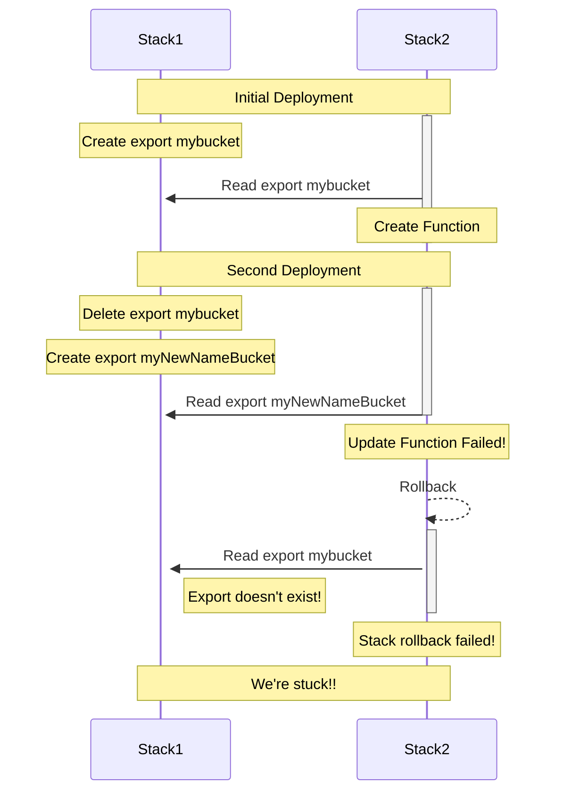

# Cross Region Stack References

## Status

accepted

## Context

The CDK allows for you to natively (in code) reference resources between stacks. For example:

```ts
const bucket = new s3.Bucket(stack1, 'Bucket');
const handler = new lambda.Function(stack2, 'Handler');
bucket.grantRead(handler);
```

Here we have create an S3 bucket in one stack and natively referenced the bucket from a resource
in a different stack. This works because CDK knows that this is a cross stack reference and will create the
appropriate stack exports and imports. In this case it would create an `Export` in `stack1`.

```json
{
 "Outputs": {
  "ExportsOutputFnGetAttBucket83908E77Arn063C8555": {
   "Value": {
    "Fn::GetAtt": [
     "Bucket83908E77",
     "Arn"
    ]
   },
   "Export": {
    "Name": "stack1:ExportsOutputFnGetAttBucket83908E77Arn063C8555"
   }
  }
 }
}
```

And an "Import" in stack2

```json
{
  "Resources": {
    "HandlerServiceRoleDefaultPolicyCBD0CC91": {
       "Type": "AWS::IAM::Policy",
       "Properties": {
         "PolicyDocument": {
           "Statement": [
              {
                "Action": [
                  "s3:GetBucket*",
                  "s3:GetObject*",
                  "s3:List*"
                ],
                "Effect": "Allow",
                "Resource": [
                  {
                    "Fn::ImportValue": "stack1:ExportsOutputFnGetAttBucket83908E77Arn063C8555"
                  },
                  {
                    "Fn::Join": [
                      "",
                      [
                        {
                          "Fn::ImportValue": "stack1:ExportsOutputFnGetAttBucket83908E77Arn063C8555"
                        },
                        "/*"
                      ]
                    ]
                  }
                ]
              }
           ],
         "Version": "2012-10-17"
         },
         "PolicyName": "HandlerServiceRoleDefaultPolicyCBD0CC91",
         "Roles": [
           {
             "Ref": "HandlerServiceRoleFCDC14AE"
           }
         ]
       }
    }
  }
}
```

If these stack exist in different regions this is no longer possible. This is due to
an underlying limitation with CloudFormation, namely that Stack Exports/Imports do not
work cross-region. There are some cases where cross region references are _required_
by the AWS services themselves. A good example of this is AWS CloudFront. CloudFront is a global
service and you can create a CloudFront distribution via CloudFormation in any AWS Region. Other
resources that are used by CloudFront are required to be created in the `us-east-1` region.

For example, lets say you have an application that you created in `us-east-2`.

```ts
const appStack = new Stack(app, 'AppStack', { env: { region: 'us-east-2' } });
const service = new ApplicationLoadBalancedFargateService(appStack, 'Service');
```

If I want to add CloudFront to this application. I can add the distribution in the
same Stack, but if I also want to add a ACM Certificate (why wouldn't I?) it becomes
more difficult. In order to use a ACM Certificate with CloudFront, the certificate
must be created in `us-east-1` regardless of what region you create the CloudFront
distribution from.

```ts
const appStack = new Stack(app, 'AppStack', { env: { region: 'us-east-2' } });
const service = new ApplicationLoadBalancedFargateService(appStack, 'Service');

// this won't work!!!
const certificate = new acm.Certificate(appStack, 'Cert');
const distribution = new Distribution(appStack, 'Distribution', {
  defaultBehavior: { origin: new LoadBalancerV2Origin(service.loadBalancer) },
  certificate,
});
```

To workaround this issue we have created things like the `DnsValidatedCertificate` construct
which uses custom resources to create the certificate in `us-east-1`. This requires us
to essentially maintain our own `Certificate` resource that maintains feature parity with the
official `AWS::CertificateManager::Certificate` resource.

Another example is the `aws-cloudfront.experimental` `EdgeFunction` construct. This takes
a different approach to managing cross region resources. Instead of creating the resources with
a custom resource, we instead create a support stack in `us-east-1` which creates the lambda
function. We then use a custom resource to "lookup" the function arn in the Stack that creates the
CloudFront distribution. This is becoming our recommended pattern for creating cross-region
resources, so why not add an officially supported method for doing this.

## Constraints

The biggest constraint with implementing a solution is CloudFormation itself. A common
request from CDK users is for the CDK to support [weak
references](https://github.com/aws/aws-cdk-rfcs/issues/82). The reason we have not yet implemented
this feature is that there are good reasons as to why strong references exist and are the only
officially supported method.

Let's walk through an example to illustrate. Suppose I had a Lambda function that referenced an S3
bucket in some way (read data, write data, etc). CloudFormation will create a "strong" reference
between these two resources.

```ts
const bucket = new s3.Bucket(stack1, 'Bucket', {
  bucketName: 'mybucket',
});
const handler = new lambda.Function(stack2, 'Handler', {
  environment: {
    BUCKET_NAME: bucket.bucketName,
  },
});
bucket.grantRead(handler);
```

If I tried to update the bucket, for example changing the name from `mybucket` to `myNewNameBucket`
CloudFormation will fail the deployment for stack1 and prevent the bucket from being recreated. This
is because it _knows_ that `stack2` is using the bucket. If it allows the bucket to change and the
export to change you could end up in an unrecoverable state for `stack2`.



For the CDK to implement it's own concept of references it needs to take this into account.

### Custom Resources

This solution utilizes custom resources to manage outputs/imports, and custom resources come with
their own constraints.

- Custom resources are only executed when the properties change. There is no way to have the
	resource execute on every deploy.

- Custom resources only know about the current update (via `ResourceProperties`) and the previous update
	(via `OldResourceProperties`). Custom resources cannot keep track of all prior updates, unless
	we were to implement some external state mechanism.


## Decision

The CDK will natively support cross region stack references.

```ts
const appStack = new Stack(app, 'AppStack', { env: { region: 'us-east-2' } });
const service = new ApplicationLoadBalancedFargateService(appStack, 'Service');

// this will work!!!
const certificate = new acm.Certificate(appStack, 'Cert');
const distribution = new Distribution(appStack, 'Distribution', {
  defaultBehavior: { origin: new LoadBalancerV2Origin(service.loadBalancer) },
  certificate,
});
```

Since it is not natively supported by CloudFormation we will use CloudFormation custom resources to
perform the output/import. This behavior will not be enabled by default and will be controlled by an
optional Stack property.

```ts
new Stack(app, 'MyStack', {
  crossRegionReferences: true,
});
```

### Outputs

In order to "output" the value from the producing stack, a custom resource will be created in the
producing stack which will create an SSM parameter with a generated name in the consuming region.
For example the name might be `/cdk/exports/stack2/stack1useast1CertRefCert5C9F`.

To implement strong references the custom resources will be allowed to create new outputs, but will
only be allowed to update/delete existing outputs if the output has _not_ been imported. If it has
been imported the stack update will fail (similar to the behavior of native exports). See
[Imports](#imports) for how the import is performed.

### Imports

The consuming stack will then "import" the value via a SSM dynamic reference. This is possible
because we know the name of the SSM parameter that the producing stack creates. This will look
something like `{{resolve:ssm:/cdk/exports/stack2/stack1useast1CertRefCert5C9F}}`.

A custom resource will also be created in the consuming stack that will be responsible for marking
the SSM parameter as having been "imported". It will do so by adding a tag to the parameter,
something like `aws-cdk:strong-ref=stack2`. If the value is no longer imported by the stack then the
tag will be removed. The producing stack will use the presence of the tag to determine whether or
not the output can be updated/deleted.

Since the imports for a stack are exported as SSM parameters with the stack name as part of the name
prefix, when the importing stack is deleted it will clean up and remove any SSM parameters under
that prefix.

## Alternatives

This solution uses a push model where the producing stack "pushes" the output to the target region.
One alternative that was considered was to use a pull model where the consuming stack would "pull"
the output from the producing region. For example the producing stack could produce a normal
CloudFormation export and then the consuming stack would have a custom resource the reads the
exports.

This alternative had several limitations:
1. No way to implement strong references. CloudFormation would not know the export is being used and
   would allow it to be updated/deleted.
2. The consuming custom resource would need to run every time the stack is deployed. This would
   require introducing a salt that would cause a template diff on every deploy (not ideal).

## Consequences

If we add support for cross region references we will need to support cross region references going
forward. We will not be tied to this implementation though.
