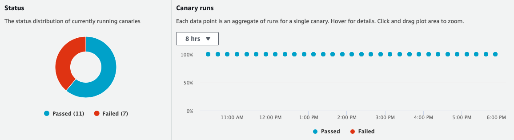

# Amazon CloudWatch Synthetics Construct Library

Amazon CloudWatch Synthetics allow you to monitor your application by generating **synthetic** traffic. The traffic is produced by a **canary**: a configurable script that runs on a schedule. You configure the canary script to follow the same routes and perform the same actions as a user, which allows you to continually verify your user experience even when you don't have any traffic on your applications.

## Canary

To illustrate how to use a canary, assume your application defines the following endpoint:

```console
% curl "https://api.example.com/user/books/topbook/"
The Hitchhikers Guide to the Galaxy
```

The below code defines a canary that will hit the `books/topbook` endpoint every 5 minutes:

```ts
const canary = new synthetics.Canary(this, 'MyCanary', {
  schedule: synthetics.Schedule.rate(Duration.minutes(5)),
  test: synthetics.Test.custom({
    code: synthetics.Code.fromAsset(path.join(__dirname, 'canary')),
    handler: 'index.handler',
  }),
  runtime: synthetics.Runtime.SYNTHETICS_NODEJS_PUPPETEER_6_0,
  environmentVariables: {
    stage: 'prod',
  },
});
```

The following is an example of an `index.js` file which exports the `handler` function:

```js
const synthetics = require('Synthetics');
const log = require('SyntheticsLogger');

const pageLoadBlueprint = async function () {
  // Configure the stage of the API using environment variables
  const url = `https://api.example.com/${process.env.stage}/user/books/topbook/`;

  const page = await synthetics.getPage();
  const response = await page.goto(url, { waitUntil: 'domcontentloaded', timeout: 30000 });
  // Wait for page to render. Increase or decrease wait time based on endpoint being monitored.
  await page.waitFor(15000);
  // This will take a screenshot that will be included in test output artifacts.
  await synthetics.takeScreenshot('loaded', 'loaded');
  const pageTitle = await page.title();
  log.info('Page title: ' + pageTitle);
  if (response.status() !== 200) {
    throw 'Failed to load page!';
  }
};

exports.handler = async () => {
  return await pageLoadBlueprint();
};
```

> **Note:** The function **must** be called `handler`.

The canary will automatically produce a CloudWatch Dashboard:



The Canary code will be executed in a lambda function created by Synthetics on your behalf. The Lambda function includes a custom [runtime](https://docs.aws.amazon.com/AmazonCloudWatch/latest/monitoring/CloudWatch_Synthetics_Canaries_Library.html) provided by Synthetics. The provided runtime includes a variety of handy tools such as [Puppeteer](https://www.npmjs.com/package/puppeteer-core) (for nodejs based one) and Chromium.

To learn more about Synthetics capabilities, check out the [docs](https://docs.aws.amazon.com/AmazonCloudWatch/latest/monitoring/CloudWatch_Synthetics_Canaries.html).

### Canary Schedule

You can specify the schedule on which a canary runs by providing a
[`Schedule`](https://docs.aws.amazon.com/cdk/api/latest/docs/@aws-cdk_aws-synthetics.Schedule.html)
object to the `schedule` property.

Configure a run rate of up to 60 minutes with `Schedule.rate`:

```ts
const schedule = synthetics.Schedule.rate(Duration.minutes(5)); // Runs every 5 minutes.
```

You can also specify a [cron expression](https://docs.aws.amazon.com/AmazonCloudWatch/latest/monitoring/CloudWatch_Synthetics_Canaries_cron.html) with `Schedule.cron`:

```ts
const schedule = synthetics.Schedule.cron({
  hour: '0,8,16', // Run at 12am, 8am, 4pm UTC every day
});
```

If you want the canary to run just once upon deployment, you can use `Schedule.once()`.

### Deleting underlying resources on canary deletion

When you delete a lambda, the following underlying resources are isolated in your AWS account:

  - Lambda Function that runs your canary script
  - S3 Bucket for artifact storage
  - IAM roles and policies
  - Log Groups in CloudWatch Logs.

To learn more about these underlying resources, see
[Synthetics Canaries Deletion](https://docs.aws.amazon.com/AmazonCloudWatch/latest/monitoring/synthetics_canaries_deletion.html).

In the CDK, you can configure your canary to delete the underlying lambda function when the canary is deleted.
This can be provisioned by setting `cleanup: Cleanup.LAMBDA`. Note that this
will create a custom resource under the hood that takes care of the lambda deletion for you.

```ts
const canary = new synthetics.Canary(this, 'Canary', {
  test: synthetics.Test.custom({
    handler: 'index.handler',
    code: synthetics.Code.fromInline('/* Synthetics handler code'),
  }),
  cleanup: synthetics.Cleanup.LAMBDA,
  runtime: synthetics.Runtime.SYNTHETICS_NODEJS_PUPPETEER_6_0,
});
```

> Note: To properly clean up your canary on deletion, you still have to manually delete other resources 
> like S3 buckets and CloudWatch logs.

### Configuring the Canary Script

To configure the script the canary executes, use the `test` property. The `test` property accepts a `Test` instance that can be initialized by the `Test` class static methods. Currently, the only implemented method is `Test.custom()`, which allows you to bring your own code. In the future, other methods will be added. `Test.custom()` accepts `code` and `handler` properties -- both are required by Synthetics to create a lambda function on your behalf.

The `synthetics.Code` class exposes static methods to bundle your code artifacts:

  - `code.fromInline(code)` - specify an inline script.
  - `code.fromAsset(path)` - specify a .zip file or a directory in the local filesystem which will be zipped and uploaded to S3 on deployment. See the above Note for directory structure.
  - `code.fromBucket(bucket, key[, objectVersion])` - specify an S3 object that contains the .zip file of your runtime code. See the above Note for directory structure.

Using the `Code` class static initializers:

```ts
// To supply the code inline:
new synthetics.Canary(this, 'Inline Canary', {
  test: synthetics.Test.custom({
    code: synthetics.Code.fromInline('/* Synthetics handler code */'),
    handler: 'index.handler', // must be 'index.handler'
  }),
  runtime: synthetics.Runtime.SYNTHETICS_NODEJS_PUPPETEER_6_0,
});

// To supply the code from your local filesystem:
new synthetics.Canary(this, 'Asset Canary', {
  test: synthetics.Test.custom({
    code: synthetics.Code.fromAsset(path.join(__dirname, 'canary')),
    handler: 'index.handler', // must end with '.handler'
  }),
  runtime: synthetics.Runtime.SYNTHETICS_NODEJS_PUPPETEER_6_0,
});

// To supply the code from a S3 bucket:
import * as s3 from 'aws-cdk-lib/aws-s3';
const bucket = new s3.Bucket(this, 'Code Bucket');
new synthetics.Canary(this, 'Bucket Canary', {
  test: synthetics.Test.custom({
    code: synthetics.Code.fromBucket(bucket, 'canary.zip'),
    handler: 'index.handler', // must end with '.handler'
  }),
  runtime: synthetics.Runtime.SYNTHETICS_NODEJS_PUPPETEER_6_0,
});
```

> **Note:** Synthetics have a specified folder structure for canaries. For Node scripts supplied via `code.fromAsset()` or `code.fromBucket()`, the canary resource requires the following folder structure:
>
> ```plaintext
> canary/
> ├── nodejs/
>    ├── node_modules/
>         ├── <filename>.js
> ```
>
>
> For Python scripts supplied via `code.fromAsset()` or `code.fromBucket()`, the canary resource requires the following folder structure:
>
> ```plaintext
> canary/
> ├── python/
>     ├── <filename>.py
> ```
>
> See Synthetics [docs](https://docs.aws.amazon.com/AmazonCloudWatch/latest/monitoring/CloudWatch_Synthetics_Canaries_WritingCanary.html).

### Running a canary on a VPC

You can specify what [VPC a canary executes in](https://docs.aws.amazon.com/AmazonCloudWatch/latest/monitoring/CloudWatch_Synthetics_Canaries_VPC.html).
This can allow for monitoring services that may be internal to a specific VPC. To place a canary within a VPC, you can specify the `vpc` property with the desired `VPC` to place then canary in.
This will automatically attach the appropriate IAM permissions to attach to the VPC. This will also create a Security Group and attach to the default subnets for the VPC unless specified via `vpcSubnets` and `securityGroups`.

```ts
import * as ec2 from 'aws-cdk-lib/aws-ec2';

declare const vpc: ec2.IVpc;
new synthetics.Canary(this, 'Vpc Canary', {
  test: synthetics.Test.custom({
    code: synthetics.Code.fromAsset(path.join(__dirname, 'canary')),
    handler: 'index.handler',
  }),
  runtime: synthetics.Runtime.SYNTHETICS_NODEJS_PUPPETEER_6_0,
  vpc,
});
```

> **Note:** By default, the Synthetics runtime needs access to the S3 and CloudWatch APIs, which will fail in a private subnet without internet access enabled (e.g. an isolated subnnet).
>
> Ensure that the Canary is placed in a VPC either with internet connectivity or with VPC Endpoints for S3 and CloudWatch enabled and configured.
>
> See [Synthetics VPC docs](https://docs.aws.amazon.com/AmazonCloudWatch/latest/monitoring/CloudWatch_Synthetics_Canaries_VPC.html).

### Alarms

You can configure a CloudWatch Alarm on a canary metric. Metrics are emitted by CloudWatch automatically and can be accessed by the following APIs:

- `canary.metricSuccessPercent()` - percentage of successful canary runs over a given time
- `canary.metricDuration()` - how much time each canary run takes, in seconds.
- `canary.metricFailed()` - number of failed canary runs over a given time

Create an alarm that tracks the canary metric:

```ts
import * as cloudwatch from 'aws-cdk-lib/aws-cloudwatch';

declare const canary: synthetics.Canary;
new cloudwatch.Alarm(this, 'CanaryAlarm', {
  metric: canary.metricSuccessPercent(),
  evaluationPeriods: 2,
  threshold: 90,
  comparisonOperator: cloudwatch.ComparisonOperator.LESS_THAN_THRESHOLD,
});
```

### Artifacts

You can pass an S3 bucket to store artifacts from canary runs. If you do not,
one will be auto-generated when the canary is created. You may add
[lifecycle rules](https://docs.aws.amazon.com/AmazonS3/latest/userguide/object-lifecycle-mgmt.html)
to the auto-generated bucket.

```ts
const canary = new synthetics.Canary(this, 'MyCanary', {
  schedule: synthetics.Schedule.rate(Duration.minutes(5)),
  test: synthetics.Test.custom({
    code: synthetics.Code.fromAsset(path.join(__dirname, 'canary')),
    handler: 'index.handler',
  }),
  runtime: synthetics.Runtime.SYNTHETICS_NODEJS_PUPPETEER_6_0,
  artifactsBucketLifecycleRules: [{
    expiration: Duration.days(30),
  }],
});
```
