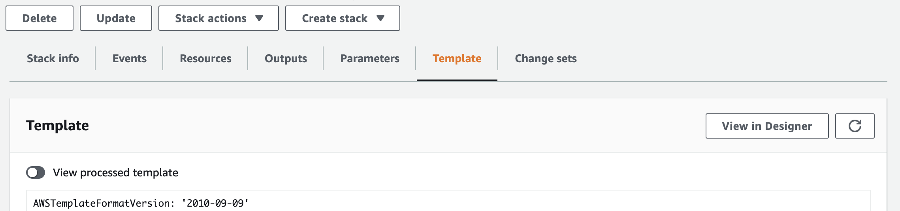
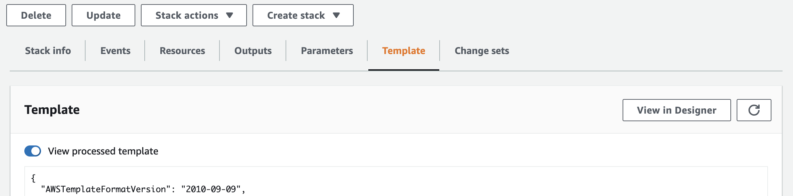

# Include CloudFormation templates in the CDK


This module contains a set of classes whose goal is to facilitate working
with existing CloudFormation templates in the CDK.
It can be thought of as an extension of the capabilities of the
[`CfnInclude` class](https://docs.aws.amazon.com/cdk/api/latest/docs/@aws-cdk_core.CfnInclude.html).

## Basic usage

Assume we have a file with an existing template.
It could be in JSON format, in a file `my-template.json`:

```json
{
  "Resources": {
    "Bucket": {
      "Type": "AWS::S3::Bucket",
      "Properties": {
        "BucketName": "some-bucket-name"
      }
    }
  }
}
```

Or it could by in YAML format, in a file `my-template.yaml`:

```yaml
Resources:
  Bucket:
    Type: AWS::S3::Bucket
    Properties:
      BucketName: some-bucket-name
```

It can be included in a CDK application with the following code:

```ts
const cfnTemplate = new cfn_inc.CfnInclude(this, 'Template', {
  templateFile: 'my-template.json',
});
```

Or, if your template uses YAML:

```ts
const cfnTemplate = new cfn_inc.CfnInclude(this, 'Template', {
  templateFile: 'my-template.yaml',
});
```

**Note**: different YAML parsers sometimes don't agree on what exactly constitutes valid YAML.
If you get a YAML exception when including your template,
try converting it to JSON, and including that file instead.
If you're downloading your template from the CloudFormation AWS Console,
you can easily get it in JSON format by clicking the 'View in Designer'
button on the 'Template' tab -
once in Designer, select JSON in the "Choose template language"
radio buttons on the bottom pane.

This will add all resources from `my-template.json` / `my-template.yaml` into the CDK application,
preserving their original logical IDs from the template file.

Any resource from the included template can be retrieved by referring to it by its logical ID from the template.
If you know the class of the CDK object that corresponds to that resource,
you can cast the returned object to the correct type:

```ts
declare const cfnTemplate: cfn_inc.CfnInclude;
const cfnBucket = cfnTemplate.getResource('Bucket') as s3.CfnBucket;
// cfnBucket is of type s3.CfnBucket
```

Note that any resources not present in the latest version of the CloudFormation schema
at the time of publishing the version of this module that you depend on,
including [Custom Resources](https://docs.aws.amazon.com/AWSCloudFormation/latest/UserGuide/aws-resource-cfn-customresource.html),
will be returned as instances of the class `CfnResource`,
and so cannot be cast to a different resource type.

Any modifications made to that resource will be reflected in the resulting CDK template;
for example, the name of the bucket can be changed:

```ts
declare const cfnTemplate: cfn_inc.CfnInclude;
const cfnBucket = cfnTemplate.getResource('Bucket') as s3.CfnBucket;
cfnBucket.bucketName = 'my-bucket-name';
```

You can also refer to the resource when defining other constructs,
including the higher-level ones
(those whose name does not start with `Cfn`),
for example:

```ts
declare const cfnTemplate: cfn_inc.CfnInclude;
const cfnBucket = cfnTemplate.getResource('Bucket') as s3.CfnBucket;

const role = new iam.Role(this, 'Role', {
  assumedBy: new iam.AnyPrincipal(),
});
role.addToPolicy(new iam.PolicyStatement({
  actions: ['s3:*'],
  resources: [cfnBucket.attrArn],
}));
```

## Migrating templates that use Transforms

You can use this module to migrate templates that use
[CloudFormation transforms](https://docs.aws.amazon.com/AWSCloudFormation/latest/UserGuide/template-macros.html) -
including the [Serverless transform](https://docs.aws.amazon.com/AWSCloudFormation/latest/UserGuide/transform-aws-serverless.html).

The CDK including process does not execute Transforms,
and the `cdk diff` command by default compares against the original
(meaning, unprocessed) template.
So, if you're downloading the template to include from the CloudFormation AWS Console,
make sure to download the unprocessed template
(the "View processed template" checkbox is left **unchecked**, which is the default):



However, certain unprocessed templates can fail when used with the `CfnInclude` class.
The most common reason for the failure is that the unprocessed template can contain cycles between resources,
which get removed after the Transform is processed,
but is not allowed when being included (as pure CloudFormation does not permit cycles). To enable cycle processing behavior similar
to cloudformation, set `allowCyclicalReferences` of CfnIncludeProps to true.


When that happens, you should instead download the processed template from the CloudFormation AWS Console
(make sure the "View processed template" checkbox is **checked** in that case):



When you include that processed template in your CDK application,
running `cdk diff` will now show a lot of differences with the deployed Stack,
because `cdk diff` uses the unprocessed template by default.
To alleviate that problem, you can pass the `--processed` switch to `cdk diff`,
which will make the diff command compare against the processed template of the deployed Stack,
which will give more precise results in this case.

## Converting L1 resources to L2

The resources the `getResource` method returns are what the CDK calls
[Layer 1 resources](https://docs.aws.amazon.com/cdk/latest/guide/cfn_layer.html#cfn_layer_cfn)
(like `CfnBucket`).
However, in many places in the Construct Library,
the CDK requires so-called Layer 2 resources, like `IBucket`.
There are two ways of going from an L1 to an L2 resource.

### Using`fromCfn*()` methods

This is the preferred method of converting an L1 resource to an L2.
It works by invoking a static method of the class of the L2 resource
whose name starts with `fromCfn` -
for example, for KMS Keys, that would be the `Kms.fromCfnKey()` method -
and passing the L1 instance as an argument:

```ts
declare const cfnTemplate: cfn_inc.CfnInclude;
const cfnKey = cfnTemplate.getResource('Key') as kms.CfnKey;
const key = kms.Key.fromCfnKey(cfnKey);
```

This returns an instance of the `kms.IKey` type that can be passed anywhere in the CDK an `IKey` is expected.
What is more, that `IKey` instance will be mutable -
which means calling any mutating methods on it,
like `addToResourcePolicy()`,
will be reflected in the resulting template.

Note that, in some cases, the `fromCfn*()` method might not be able to create an L2 from the underlying L1.
This can happen when the underlying L1 heavily uses CloudFormation functions.
For example, if you tried to create an L2 `IKey`
from an L1 represented as this CloudFormation template:

```json
{
  "Resources": {
    "Key": {
      "Type": "AWS::KMS::Key",
      "Properties": {
        "KeyPolicy": {
          "Statement": [
            {
              "Fn::If": [
                "Condition",
                {
                  "Action": "kms:if-action",
                  "Resource": "*",
                  "Principal": "*",
                  "Effect": "Allow"
                },
                {
                  "Action": "kms:else-action",
                  "Resource": "*",
                  "Principal": "*",
                  "Effect": "Allow"
                }
              ]
            }
          ],
          "Version": "2012-10-17"
        }
      }
    }
  }
}
```

The `Key.fromCfnKey()` method does not know how to translate that into CDK L2 concepts,
and would throw an exception.

In those cases, you need the use the second method of converting an L1 to an L2.

### Using `from*Name/Arn/Attributes()` methods

If the resource you need does not have a `fromCfn*()` method,
or if it does, but it throws an exception for your particular L1,
you need to use the second method of converting an L1 resource to L2.

Each L2 class has static factory methods with names like `from*Name()`,
`from*Arn()`, and/or `from*Attributes()`.
You can obtain an L2 resource from an L1 by passing the correct properties of the L1 as the arguments to those methods:

```ts
declare const cfnTemplate: cfn_inc.CfnInclude;

// using from*Name()
const cfnBucket = cfnTemplate.getResource('Bucket') as s3.CfnBucket;
const bucket = s3.Bucket.fromBucketName(this, 'L2Bucket', cfnBucket.ref);

// using from*Arn()
const cfnKey = cfnTemplate.getResource('Key') as kms.CfnKey;
const key = kms.Key.fromKeyArn(this, 'L2Key', cfnKey.attrArn);

// using from*Attributes()
declare const privateCfnSubnet1: ec2.CfnSubnet;
declare const privateCfnSubnet2: ec2.CfnSubnet;
const cfnVpc = cfnTemplate.getResource('Vpc') as ec2.CfnVPC;
const vpc = ec2.Vpc.fromVpcAttributes(this, 'L2Vpc', {
  vpcId: cfnVpc.ref,
  availabilityZones: core.Fn.getAzs(),
  privateSubnetIds: [privateCfnSubnet1.ref, privateCfnSubnet2.ref],
});
```

As long as they just need to be referenced,
and not changed in any way, everything should work;
however, note that resources returned from those methods,
unlike those returned by `fromCfn*()` methods,
are immutable, which means calling any mutating methods on them will have no effect.
You will have to mutate the underlying L1 in order to change them.

## Non-resource template elements

In addition to resources,
you can also retrieve and mutate all other template elements:

* [Parameters](https://docs.aws.amazon.com/AWSCloudFormation/latest/UserGuide/parameters-section-structure.html):

  ```ts
  declare const cfnTemplate: cfn_inc.CfnInclude;
  const param: core.CfnParameter = cfnTemplate.getParameter('MyParameter');

  // mutating the parameter
  param.default = 'MyDefault';
  ```

* [Conditions](https://docs.aws.amazon.com/AWSCloudFormation/latest/UserGuide/conditions-section-structure.html):

  ```ts
  declare const cfnTemplate: cfn_inc.CfnInclude;
  const condition: core.CfnCondition = cfnTemplate.getCondition('MyCondition');

  // mutating the condition
  condition.expression = core.Fn.conditionEquals(1, 2);
  ```

* [Mappings](https://docs.aws.amazon.com/AWSCloudFormation/latest/UserGuide/mappings-section-structure.html):

  ```ts
  declare const cfnTemplate: cfn_inc.CfnInclude;
  const mapping: core.CfnMapping = cfnTemplate.getMapping('MyMapping');

  // mutating the mapping
  mapping.setValue('my-region', 'AMI', 'ami-04681a1dbd79675a5');
  ```

* [Service Catalog template Rules](https://docs.aws.amazon.com/servicecatalog/latest/adminguide/reference-template_constraint_rules.html):

  ```ts
  declare const cfnTemplate: cfn_inc.CfnInclude;
  const rule: core.CfnRule = cfnTemplate.getRule('MyRule');

  // mutating the rule
  declare const myParameter: core.CfnParameter;
  rule.addAssertion(core.Fn.conditionContains(['m1.small'], myParameter.valueAsString),
    'MyParameter has to be m1.small');
  ```

* [Outputs](https://docs.aws.amazon.com/AWSCloudFormation/latest/UserGuide/outputs-section-structure.html):

  ```ts
  declare const cfnTemplate: cfn_inc.CfnInclude;
  const output: core.CfnOutput = cfnTemplate.getOutput('MyOutput');

  // mutating the output
  declare const cfnBucket: s3.CfnBucket;
  output.value = cfnBucket.attrArn;
  ```

* [Hooks for blue-green deployments](https://docs.aws.amazon.com/AWSCloudFormation/latest/UserGuide/blue-green.html):

  ```ts
  declare const cfnTemplate: cfn_inc.CfnInclude;
  const hook: core.CfnHook = cfnTemplate.getHook('MyOutput');

  // mutating the hook
  declare const myRole: iam.Role;
  const codeDeployHook = hook as core.CfnCodeDeployBlueGreenHook;
  codeDeployHook.serviceRole = myRole.roleArn;
  ```

## Parameter replacement

If your existing template uses CloudFormation Parameters,
you may want to remove them in favor of build-time values.
You can do that using the `parameters` property:

```ts
new cfn_inc.CfnInclude(this, 'includeTemplate', {
  templateFile: 'path/to/my/template',
  parameters: {
    'MyParam': 'my-value',
  },
});
```

This will replace all references to `MyParam` with the string `'my-value'`,
and `MyParam` will be removed from the 'Parameters' section of the resulting template.

## Nested Stacks

This module also supports templates that use [nested stacks](https://docs.aws.amazon.com/AWSCloudFormation/latest/UserGuide/using-cfn-nested-stacks.html).

For example, if you have the following parent template:

```json
{
  "Resources": {
    "ChildStack": {
      "Type": "AWS::CloudFormation::Stack",
      "Properties": {
        "TemplateURL": "https://my-s3-template-source.s3.amazonaws.com/child-stack.json"
      }
    }
  }
}
```

where the child template pointed to by `https://my-s3-template-source.s3.amazonaws.com/child-stack.json` is:

```json
{
  "Resources": {
    "MyBucket": {
      "Type": "AWS::S3::Bucket"
    }
  }
}
```

You can include both the parent stack,
and the nested stack in your CDK application as follows:

```ts
const parentTemplate = new cfn_inc.CfnInclude(this, 'ParentStack', {
  templateFile: 'path/to/my-parent-template.json',
  loadNestedStacks: {
    'ChildStack': {
      templateFile: 'path/to/my-nested-template.json',
    },
  },
});
```

Here, `path/to/my-nested-template.json`
represents the path on disk to the downloaded template file from the original template URL of the nested stack
(`https://my-s3-template-source.s3.amazonaws.com/child-stack.json`).
In the CDK application,
this file will be turned into an [Asset](https://docs.aws.amazon.com/cdk/latest/guide/assets.html),
and the `TemplateURL` property of the nested stack resource
will be modified to point to that asset.

The included nested stack can be accessed with the `getNestedStack` method:

```ts
declare const parentTemplate: cfn_inc.CfnInclude;

const includedChildStack = parentTemplate.getNestedStack('ChildStack');
const childStack: core.NestedStack = includedChildStack.stack;
const childTemplate: cfn_inc.CfnInclude = includedChildStack.includedTemplate;
```

Now you can reference resources from `ChildStack`,
and modify them like any other included template:

```ts
declare const childTemplate: cfn_inc.CfnInclude;

const cfnBucket = childTemplate.getResource('MyBucket') as s3.CfnBucket;
cfnBucket.bucketName = 'my-new-bucket-name';

const role = new iam.Role(this, 'MyRole', {
  assumedBy: new iam.AccountRootPrincipal(),
});

role.addToPolicy(new iam.PolicyStatement({
  actions: [
    's3:GetObject*',
    's3:GetBucket*',
    's3:List*',
  ],
  resources: [cfnBucket.attrArn],
}));
```

You can also include the nested stack after the `CfnInclude` object was created,
instead of doing it on construction:

```ts
declare const parentTemplate: cfn_inc.CfnInclude;
const includedChildStack = parentTemplate.loadNestedStack('ChildTemplate', {
  templateFile: 'path/to/my-nested-template.json',
});
```

## Vending CloudFormation templates as Constructs

In many cases, there are existing CloudFormation templates that are not entire applications,
but more like specialized fragments, implementing a particular pattern or best practice.
If you have templates like that,
you can use the `CfnInclude` class to vend them as CDK Constructs:

```ts nofixture
import { Construct } from 'constructs';
import * as cfn_inc from 'aws-cdk-lib/cloudformation-include';
import * as path from 'path';

export class MyConstruct extends Construct {
  constructor(scope: Construct, id: string) {
    super(scope, id);

    // include a template inside the Construct
    new cfn_inc.CfnInclude(this, 'MyConstruct', {
      templateFile: path.join(__dirname, 'my-template.json'),
      preserveLogicalIds: false, // <--- !!!
    });
  }
}
```

Notice the `preserveLogicalIds` parameter -
it makes sure the logical IDs of all the included template elements are re-named using CDK's algorithm,
guaranteeing they are unique within your application.
Without that parameter passed,
instantiating `MyConstruct` twice in the same Stack would result in duplicated logical IDs.
